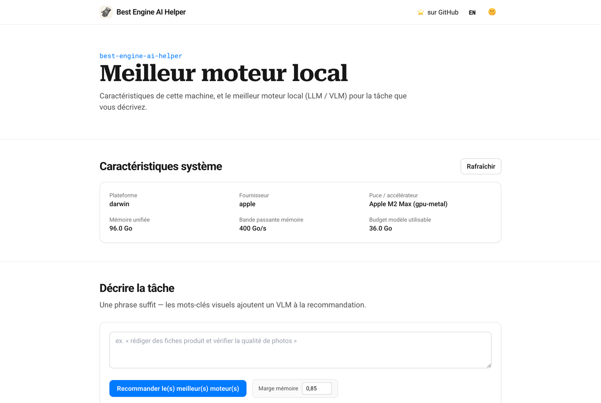
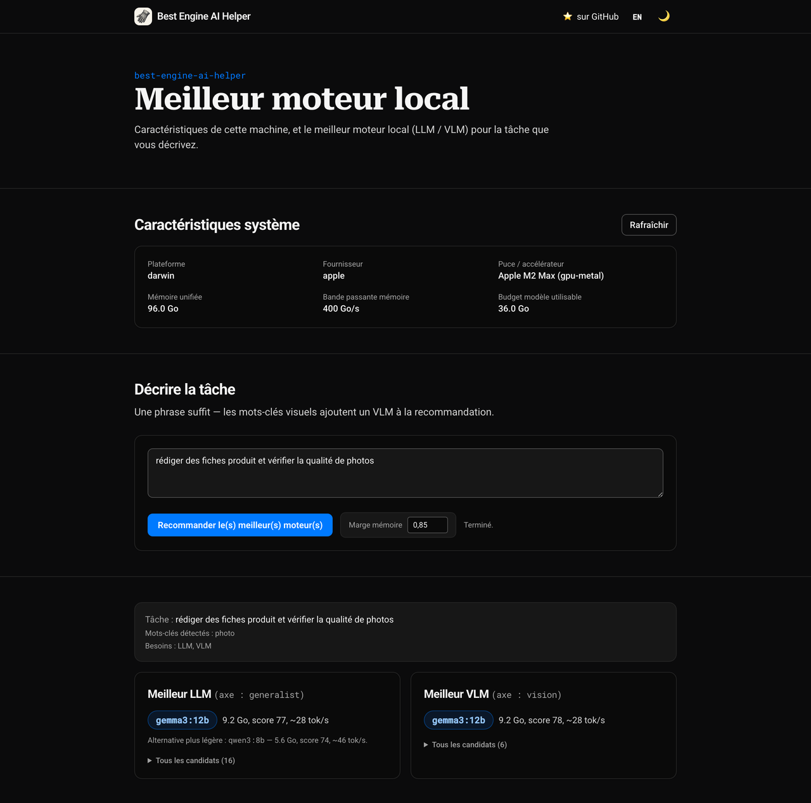
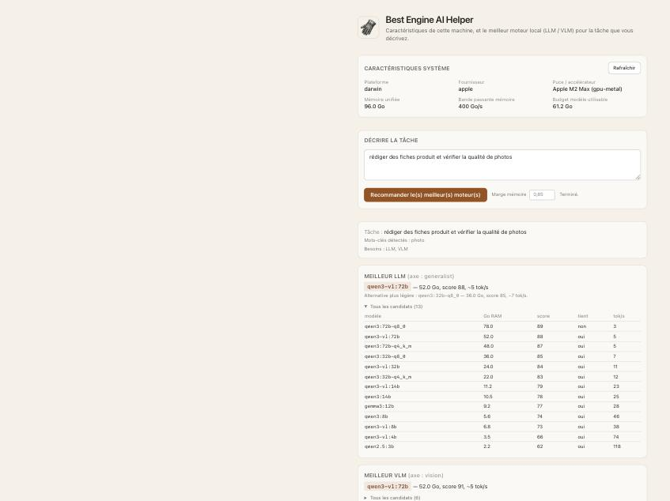

# GUI: Best Engine AI Helper

A minimal single-page GUI, served by a small FastAPI app, for the two things
you'd otherwise run `detect` and `report` for: seeing this machine's hardware,
and getting the best local engine(s) for a task description, without leaving
the browser.

Keeps the AI Helpers suite's house style: **vanilla JS + Tailwind (CDN), no
build step, no framework, no npm.** The GUI is a thin client over the same
library calls the CLI uses (`detect.available_memory()`,
`detect.compute_profile()`, `score.effective_budget()`, and
`recommend.recommend()`), so its numbers always match `best-engine-ai-helper
detect` / `report` run at the same moment.

**Look and feel** matches the [sprezzature-figures
gallery](https://harchaoui.org/warith/sprezzature/figures.html): Roboto /
Roboto Serif / Roboto Mono, the `#007aff` brand blue, a neutral gray scale,
and the same sticky-header / bordered-section rhythm. Light and dark both
ship; the 🌞/🌙 toggle in the header persists to `localStorage` and defaults
to the OS preference, matching `[data-color-scheme]` on `<html>`, resolved
before first paint so there's no flash.

| Light | Dark |
|---|---|
|  |  |

## Install and run

```sh
pip install best-engine-ai-helper
best-engine-ai-helper gui
# open http://127.0.0.1:8000/gui
```

`gui` is a thin wrapper around Uvicorn (`--host` / `--port` to change the
bind address). Equivalent, if you want the ASGI app directly:

```sh
uvicorn best_engine_ai_helper.api:app --port 8000
```

## Language

The page is bilingual (**French by default, English at `/gui?lang=en`**), with
a header link (a flag emoji, 🇬🇧 / 🇫🇷) that switches between them. Both are
rendered from a single template by `gui.render_gui(lang)`; every string comes
from [`locales/i18n.yaml`](locales/i18n.yaml)'s `gui:` namespace: that file is
the one place to edit wording, add a language, or check a translation, not
`gui.py`. An unknown `?lang=` falls back to `meta.default_locale` (French)
rather than erroring. The JSON API is language-neutral, so only the labels
differ; the numbers are identical.

## What it shows

### 1. System characteristics (hardware snapshot)

Platform, vendor / chip, accelerator, memory bandwidth, and the usable memory
budget (`effective_budget`, after the Apple Metal GPU-usable cap and the safety
headroom; see the README's "How selection works"). A **Refresh** button
re-probes the machine without reloading the page, useful right after plugging in
an eGPU or closing memory-heavy apps.


### 2. Describe the task → best engine(s)

Type a free-text task (the same kind of phrase `report --task "..."` takes)
and the page shows the detected language, the matched keywords and benchmark
axis, then per model kind the task needs (LLM for text, VLM when anything
visual is mentioned): the chosen model with its RAM footprint / benchmark
score / estimated tokens per second, a lighter alternative when one is nearly
as strong, and the full ranked candidate table behind a disclosure toggle.
Leaving the box empty, or typing text with no detectable language (symbols or
digits only), logs a warning server-side and falls back to a generic
text-assistant profile; see `recommend.parse_task`.



The memory headroom (default `0.85`) is editable next to the button, matching
`report --headroom`. The **live server load** checkbox next to it matches
`report --live`: checked, the recommendation also weighs current free RAM,
CPU/GPU/disk usage, and already-running engines, and the result panel gets an
extra line showing that snapshot. Unchecked (the default), the recommendation
is a deterministic function of the hardware alone.

### 3. Activity (local call ledger)

Total calls, estimated total cost, error rate, and per-user / per-model
breakdowns from the local SQLite ledger (`~/.best-engine-ai-helper/usage.db`,
see the README's "Activity ledger"). Empty until something calls
`llm.chat()`, whether this tool's own `pull`/`validate` gates or any
downstream project that imports `best_engine_ai_helper.llm` and has
recording enabled. A
**Refresh** button re-fetches without reloading the page.

## HTTP surface

The GUI is a client of three JSON endpoints, usable directly (e.g. from
another tool, or `curl`):

| Method | Path | Body | Returns |
|--------|------|------|---------|
| `GET`  | `/api/system` | (none) | hardware + compute profile + `memory_budget_gb` |
| `POST` | `/api/recommend` | `{"task": str \| null, "headroom": float, "live": bool}` | the same report `recommend()` / `report` produce, as JSON |
| `GET`  | `/api/activity` | (none) | ledger summary: `total_calls`, `total_cost_usd`, `error_rate`, `by_user`, `by_model`, `recent_errors` |

```sh
curl -s http://127.0.0.1:8000/api/system | python3 -m json.tool

curl -s -X POST http://127.0.0.1:8000/api/recommend \
     -H 'Content-Type: application/json' \
     -d '{"task": "product descriptions and image-quality checks"}' \
  | python3 -m json.tool
```

`GET /` redirects to `/gui`. `GET /docs` (FastAPI's default) has the full
OpenAPI schema.

## Icons

`assets/logo.png` (the engraved glove) is the source of every icon the page
serves: `favicon.ico`, 16/32 px favicons, `apple-touch-icon.png`, and the two
Android/PWA sizes referenced from `site.webmanifest`. All are generated,
never hand-edited, by `scripts/generate_icons.py`, which composites the logo
onto the suite's cream background (`#f7f3ea`) so it reads on light and dark
browser chrome alike. Re-run it whenever `assets/logo.png` changes:

```sh
python scripts/generate_icons.py
```

## What it deliberately doesn't do

- **No pull / validate from the browser.** `pull` downloads multi-gigabyte
  weights and runs the Ralph gates; that stays a deliberate, watched CLI
  action, not a button click.
- **No persistence.** Every recommendation is a fresh, stateless call; nothing
  is written to `~/.best-engine-ai-helper/` from the GUI.
- **No auth, no remote exposure by default.** `gui` binds to `127.0.0.1`.
  Passing `--host 0.0.0.0` is your call, not the default.
