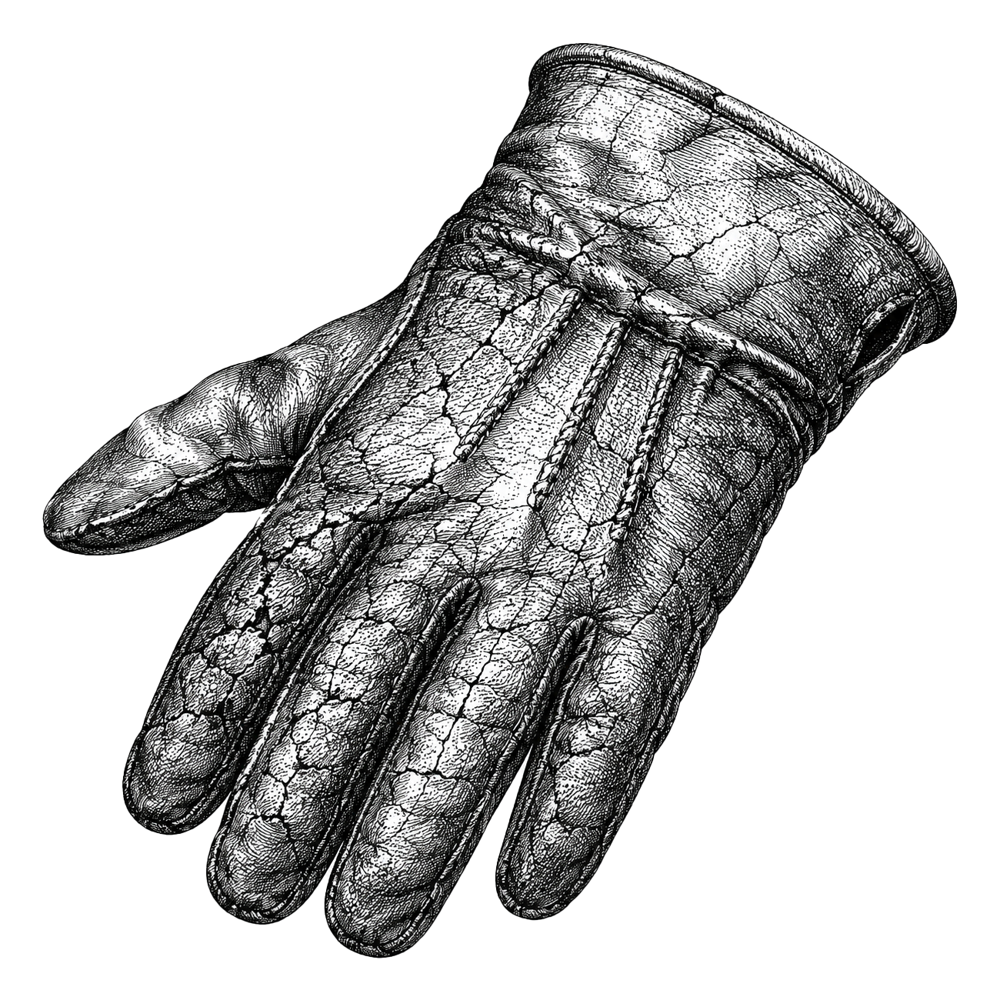

# best-engine-ai-helper

[🇫🇷](LISEZMOI.md) · [🇬🇧](README.md)

[](LICENSE)
[](#)

Choisit et télécharge le meilleur modèle de langage (LLM, *large language model*) ou modèle
de vision-langage (VLM, *vision-language model*) local adapté au matériel de la machine
courante.

L'outil détecte la mémoire disponible (mémoire unifiée Apple Silicon, mémoire vidéo NVIDIA
ou RAM système), consulte un catalogue de modèles intégré, et sélectionne le modèle au
meilleur score qui tient dans une marge de sécurité configurable. Après la sélection, il
télécharge le modèle via Ollama, exécute deux contrôles de qualité (la boucle Ralph pour la
prose et la boucle Ralph Eyeball pour la vision), et écrit un fichier d'environnement que
les projets en aval viennent sourcer.

[](https://harchaoui.org/warith/ai-helpers)

## La promesse

`best-engine-ai-helper` est conçu pour fonctionner entièrement hors ligne une fois les poids
téléchargés. Deux cas, en toute franchise :

1. **Garanti local.** La détection du matériel, la sélection du modèle, les contrôles de
   qualité et l'écriture du fichier d'environnement s'exécutent tous sur votre machine. Aucune
   télémétrie, aucun compte, aucune dépendance à un service en nuage.
2. **La seule réserve : le téléchargement initial.** La commande `pull` télécharge les poids
   du modèle via Ollama (un téléchargement normal depuis les serveurs Ollama). Ensuite, tout
   fonctionne hors ligne. La mise à jour du catalogue (`catalog update`) est également en ligne,
   mais optionnelle : le catalogue intégré suffit pour un usage courant.

## Prérequis

- Python 3.10 ou ultérieur
- [Ollama](https://ollama.com) (nécessaire uniquement pour `pull`, `validate` et `env` ; pas
  requis pour `detect` et `recommend`)
- psutil, PyYAML, click, requests (installés automatiquement)

## Installation

```sh
pip install best-engine-ai-helper
```

Depuis les sources :

```sh
git clone https://github.com/warith-harchaoui/best-engine-ai-helper
cd best-engine-ai-helper
pip install -e .
```

## Démarrage rapide

```sh
# Afficher le matériel détecté
best-engine-ai-helper detect

# Voir quels modèles seraient sélectionnés (sans téléchargement)
best-engine-ai-helper recommend

# Parcourir le catalogue complet
best-engine-ai-helper catalog show

# Parcourir la table des puces matérielles
best-engine-ai-helper hardware show
```

Voir [EXAMPLES.md](EXAMPLES.md) pour des recettes complètes avec exemples de sortie.

## Comment fonctionne la sélection

La mémoire disponible est déterminée par la première sonde qui réussit :

1. Mémoire unifiée Apple Silicon (`system_profiler SPHardwareDataType`)
2. Mémoire vidéo NVIDIA cumulée sur tous les GPU (`nvidia-smi`)
3. Mémoire vidéo AMD (`rocm-smi`)
4. La moitié de la RAM système comme estimation conservative pour un fonctionnement sur CPU

Un modèle est retenu quand son pic d'utilisation mémoire estimé représente au plus 80 % du
pool disponible (la marge laisse de la place pour les réserves du système et les pics du
cache KV). Parmi les modèles retenus, le score de benchmark le plus élevé l'emporte : score
vision pour la sélection d'un VLM, score général pour un LLM.

Quand aucun modèle ne tient, l'outil sélectionne le plus petit du catalogue et affiche un
avertissement.

## Commandes disponibles

| Commande | Description |
|----------|-------------|
| `detect` | Affiche le matériel détecté au format JSON |
| `recommend` | Classe les candidats pour ce matériel (sans téléchargement) |
| `catalog show` | Affiche le catalogue de modèles fusionné |
| `catalog update` | Rafraîchit le cache depuis quatre sources externes |
| `hardware show` | Affiche la table des puces matérielles connues |
| `hardware update` | Rafraîchit le cache matériel depuis TechPowerUp et Ollama |
| `pull` | Télécharge le meilleur modèle et exécute les contrôles Ralph |
| `validate` | Exécute les contrôles Ralph sur le modèle actuellement configuré |
| `env` | Affiche le bloc d'exports shell prêt pour `~/.zshrc` |

## Intégration avec les projets en aval

Après `best-engine-ai-helper pull`, le fichier `~/.best-engine-ai-helper/env.sh` contient :

```sh
export BEST_LLM_TEXT=qwen3-vl:72b
export BEST_LLM_VISION=qwen3-vl:72b
export BEST_LLM_BACKEND=ollama
export BEST_LLM_BASE_URL=http://localhost:11434
```

Les projets qui utilisent le modèle sélectionné sourcent ce fichier ou lisent le
`config.json` correspondant.

## Licence

[BSD-3-Clause](LICENSE). Copyright 2026 Warith Harchaoui.
