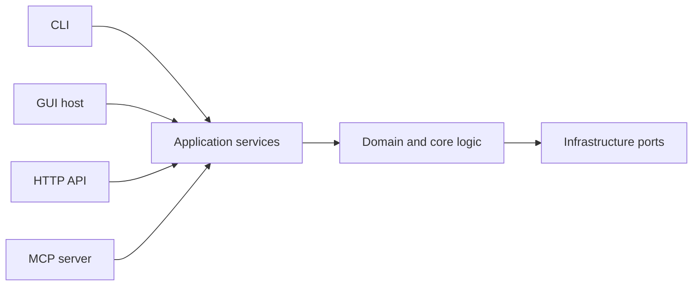
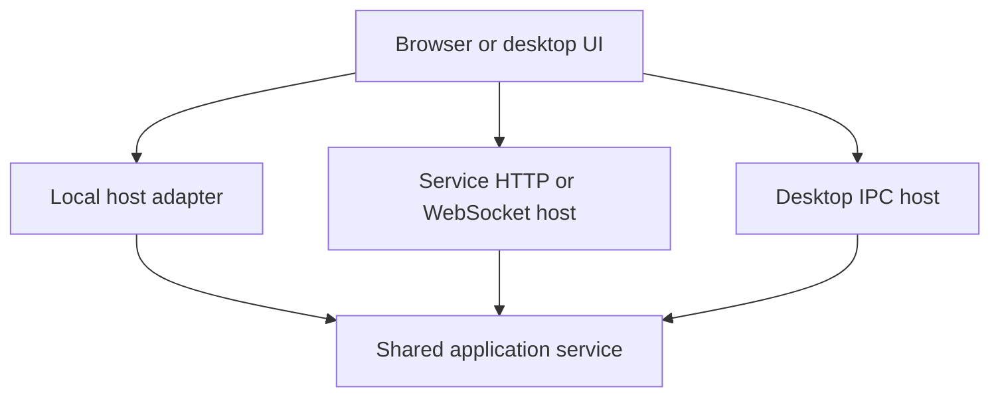

# Coding Standards for Human and AI Contributors

This document defines the engineering standard for repositories maintained by human contributors and coding agents. It is intentionally practical. A compliant repository should be readable by a newcomer, testable by a contributor, reproducible in continuous integration (CI), and usable without private context.

The standard applies to code, documentation, tests, automation, command-line interfaces (CLIs), graphical user interfaces (GUIs), application programming interfaces (APIs), agent tools, prompts, and configuration that form part of the product.

## How to read this document

The keywords have precise force:

* MUST and MUST NOT are requirements.
* SHOULD and SHOULD NOT state the expected default. A deviation needs a concrete technical reason.
* MAY marks a choice that depends on the repository.

Use these rules proportionally. Do not create ceremonial infrastructure that the project does not need. Existing repositories should improve the files and workflows touched by a task without unrelated rewrites.

When an explicit task, repository policy, platform restriction, or security constraint conflicts with this document, follow the more specific constraint. Record the deviation instead of hiding it.

## Agent execution contract

A coding agent applying this standard MUST:

1. Read repository instructions and inspect existing conventions before editing.
2. Implement the requested outcome rather than stopping at suggestions or pseudocode.
3. Reuse the repository's existing tools and dependency sources when they are sound.
4. Keep the diff focused on the task.
5. Update tests and documentation when behavior, interfaces, configuration, setup, or user-visible text changes.
6. Run the relevant checks that are available in the repository.
7. Report what changed, which checks ran, which checks did not run, and any remaining limitation.
8. Never claim a command passed unless it was executed and its result was observed.
9. Never commit credentials, local environments, generated caches, machine-specific paths, or private data.

---

## 0. Scope: private code receives the same engineering care

These rules apply to public and private implementation details alike. A leading underscore changes intended audience. It does not lower the quality bar.

The same principle covers:

* public functions and classes;
* private helpers;
* dunder methods;
* nested named functions;
* scripts and one-off utilities that are tracked as product code;
* tests;
* build and CI scripts;
* code written in any language in the repository.

Language-specific syntax changes. The obligations do not. Functions should be documented, typed where the language supports it, tested through meaningful behavior, and kept understandable to a reviewer.

### Expected repository baseline

A typical Python repository will often contain a structure close to this one:

```text
README.md
EXAMPLES.md
CODING.md
pyproject.toml
requirements.txt
requirements-dev.txt
src/<package>/ or <package>/
tests/
.github/workflows/
locales/i18n.yaml              # Required when GUI text or human-language prompts exist.
environment.yaml               # Optional Conda entry point.
Dockerfile                     # Optional container entry point.
.dockerignore                  # Required when Dockerfile exists.
```

Adapt the structure to the product. Do not create empty files only to resemble a template.

---

## 1. Use NumPy-style docstrings for Python functions and classes

Every Python function and class SHOULD have a NumPy-style docstring. Private helpers follow the same rule.

A useful docstring explains the contract a reader cannot infer safely from the signature. Common sections are:

* a short summary;
* `Parameters`;
* `Returns` or `Yields`;
* `Raises`;
* `Examples` when an example clarifies behavior;
* `Notes` for constraints or design choices.

Example:

```python
def add(a: int, b: int) -> int:
    """Return the sum of two integers.

    Parameters
    ----------
    a : int
        First operand.
    b : int
        Second operand.

    Returns
    -------
    int
        Sum of both operands.

    Examples
    --------
    >>> add(2, 3)
    5
    """
    return a + b
```

Do not expand a trivial function into a page of prose. The purpose is reconstructibility: a reader should understand the behavior, inputs, outputs, and important edge cases without opening the implementation first.

---

## 2. Give every Python module a module docstring

Every tracked `.py` file MUST begin with a module-level docstring, including private modules.

The docstring should answer four questions:

1. What does this module do?
2. Why does it exist as a separate module?
3. What does it consume?
4. What does it produce or expose?

A module with subtle lifecycle behavior, side effects, or platform assumptions should state them here.

---

## 3. Use complete typing

Type every Python function signature, including parameters and return values. Type class attributes and important module constants when that improves static analysis.

Prefer:

```python
from __future__ import annotations
```

Use structured types when a dictionary is carrying a real schema. Depending on the case, prefer `dataclass`, `TypedDict`, `Protocol`, or a Pydantic model.

Example:

```python
from typing import TypedDict


class UserRecord(TypedDict):
    """Represent one normalized user record."""

    id: int
    name: str
    is_active: bool
```

Typing should make contracts visible. It should not become decorative complexity.

---

## 4. Comment reasoning and non-obvious flow

Comments are part of the maintained explanation of the program. Comment logical blocks when the reason, constraint, or transformation would otherwise require reverse engineering.

Good comments explain:

* why an algorithm or library was chosen;
* why an edge case matters;
* why a constraint exists;
* what a non-obvious block is about to do;
* why a seemingly simpler implementation is unsafe.

Avoid comments that merely pronounce the code aloud.

Example:

```python
def _merge_records(base: dict[str, int], patch: dict[str, int]) -> dict[str, int]:
    """Merge a patch into a copy of the base mapping."""
    # Preserve the caller's mapping because several call sites reuse it after merge.
    merged = dict(base)

    for key, value in patch.items():
        # The import format uses -1 as a deletion marker. Do not persist it.
        if value == -1:
            merged.pop(key, None)
            continue

        merged[key] = value

    return merged
```

A comment-density metric MAY be used as a review signal. It must never reward filler. A shorter useful explanation is better than padding inserted to satisfy a ratio.

---

## 5. Ship an `EXAMPLES.md` cookbook

Projects with a user-facing library, CLI, GUI, API, or agent surface SHOULD include `EXAMPLES.md` at the repository root.

The file should:

* contain runnable examples;
* cover the common workflows;
* show expected output where that helps interpretation;
* link from `README.md`;
* point to localized documentation when localized documentation exists.

An example is successful when a new user can copy it, adjust obvious inputs, and reproduce the behavior.

---

## 6. Keep diagnostic output under control

Do not scatter bare `print(...)` calls through product code for progress, warnings, debugging, or diagnostics.

Use the logging system for operational messages:

```python
import logging

logger = logging.getLogger(__name__)
logger.info("Processing started")
```

Documented CLI output is different. A CLI MAY write its result to standard output and diagnostics to standard error. Such output is part of the CLI contract and must be tested.

Tutorials and examples MAY use `print(...)` because immediate output is useful to the reader.

---

## 7. Show expected output in examples

When an example prints a result, include the expected result close to the call.

```python
print(add(2, 3))
# 5
```

The reader should understand the point of an example without running it first.

---

## 8. Provide safe configuration examples

A project that expects credentials or environment-specific configuration MUST provide a committed example file.

Good formats include YAML, TOML, JSONC, INI, and `.env` when the parser supports them. Prefer formats that allow comments when explanation belongs next to the value.

An example should state:

* which keys are required;
* which keys are optional;
* what each key controls;
* what a valid value looks like;
* where a user obtains the real value;
* which default applies when a value is absent.

Use dummy values only. Never include a working secret.

Example:

```yaml
# REQUIRED. API key used to authenticate with the service.
# Obtain it from the provider's account settings.
api_key: "replace-with-your-api-key"

# OPTIONAL. Request timeout in seconds.
timeout_seconds: 30
```

Do not write commented JSON and call it JSON. Use JSONC only when the application actually parses JSONC.

---

## 9. Ignore real secrets while tracking examples

Secret-bearing local files MUST be ignored. Their example counterparts MUST remain tracked.

Example:

```gitignore
.env
.env.*
secrets.yaml
secrets.yml
*.local.yaml
*.local.yml

!.env.example
!*.yaml.example
!*.yml.example
```

When a new pattern is introduced, verify the rule with `git check-ignore -v <path>`.

---

## 10. Keep acknowledgements project-specific

Acknowledgements are optional. When used, they should describe real contributions and fit the project.

Do not hard-code personal names into a generic template. Do not treat an AI assistant as a human author unless repository governance explicitly adopts that policy.

---

## 11. Document desktop installation across supported platforms

For every OS-level dependency, document installation on the supported desktop platforms. The canonical set is:

* macOS;
* Ubuntu;
* Windows.

Example:

```text
macOS:   brew install ffmpeg
Ubuntu:  sudo apt install ffmpeg
Windows: winget install ffmpeg
```

Every Homebrew instruction should tell a first-time user where Homebrew comes from: [brew.sh](https://brew.sh/).

When a dependency is unavailable on a platform, state the limitation and the supported alternative. Silence looks like accidental omission.

---

## 12. Keep AI-assistant attribution explicit

The default policy is simple: authorship and responsibility belong to the human maintainers.

Unless repository governance states otherwise:

* do not list AI assistants as authors or contributors;
* do not add AI-generated `Co-Authored-By` trailers;
* keep public attribution focused on people who accept responsibility for the work.

Do not rewrite shared Git history casually to remove old attribution. History rewriting is destructive and requires explicit scope and approval.

---

## 13. Separate runtime dependencies from contributor dependencies

Python repositories MUST provide an obvious runtime installation path and an obvious contributor installation path.

A common arrangement is:

* `requirements.txt` for runtime dependencies;
* `requirements-dev.txt` for runtime dependencies plus tests, linting, typing, documentation, audits, and CI tools.

If `pyproject.toml` is authoritative, do not maintain a second handwritten dependency list that can drift. Let the requirements files install or derive from that source of truth.

Example:

```text
# requirements.txt
.
```

```text
# requirements-dev.txt
-r requirements.txt
pytest>=8,<9
pytest-cov>=5,<7
ruff>=0.9,<1
mypy>=1.11,<2
```

Reusable libraries should declare compatible ranges. Deployable applications should use a deliberate lock or reproducible resolution policy.

Do not use an unreviewed `pip freeze` dump as the maintained dependency specification.

### CI installation rule

Jobs that run contributor checks MUST install the contributor dependency set. Runtime smoke tests SHOULD install only runtime dependencies so accidental reliance on development packages is caught.

---

## 14. Keep virtual environments, Conda, Docker, and CI on one dependency contract

Execution wrappers must consume the same Python dependency source. Do not maintain independent package versions in Conda, Docker, CI, and requirements files.

A minimal Conda file may look like this:

```yaml
name: env-for-project
channels:
  - conda-forge
dependencies:
  - python=3.12
  - pip
  - pip:
      - -r requirements.txt
```

The Python minor version in this example is illustrative. Use the version declared by the repository and keep it aligned across CI, Docker, documentation, and environment files.

For containers, the runtime image MUST install runtime dependencies. It SHOULD run as an unprivileged user when the platform allows it.

A Docker build MUST include `.dockerignore`. Exclude caches, local environments, source-control metadata, secrets, coverage output, and other files that do not belong in the build context.

Correctness takes priority over a clever layer cache. If `requirements.txt` installs the local project, copy the necessary project files before running that installation.

---

## 15. Use `pytest` and require CI to pass

Python projects MUST use an automated test suite. `pytest` is the default unless the repository already has a sound alternative.

Tests should cover:

* normal behavior;
* important error paths;
* boundary conditions;
* behavior of private implementation paths through useful public or scenario-level tests;
* serialization and compatibility contracts when they are public;
* platform-specific behavior when the project claims cross-platform support.

Do not chase a coverage percentage at the expense of meaningful assertions. Coverage is a map of what ran. It does not prove that the behavior was checked well.

CI MUST run on the branches and pull-request flows that govern merging. A red required check blocks the merge.

Keep the suite small enough to understand. If a repository accumulates many nearly identical tests, consolidate them around behavior and data tables instead of preserving duplication.

---

## 16. Evaluate AI behavior as behavior

Projects that depend on model output need evaluation in addition to ordinary unit tests.

This includes systems built around:

* large language model (LLM) prompts;
* retrieval augmented generation (RAG);
* agents;
* embeddings;
* generative models;
* classical machine learning;
* model-backed ranking, classification, extraction, or inference.

An evaluation layer SHOULD have:

* committed representative cases;
* explicit success criteria;
* versioned thresholds when metrics are numeric;
* model and dataset version records;
* cost controls where remote inference is expensive;
* a human review path for open-ended output;
* CI gates for stable deterministic or statistical checks.

A single impressive demonstration is not evidence of reliability.

---

## 17. Enforce Python style automatically

Python code MUST follow [PEP 8](https://peps.python.org/pep-0008/) unless a repository-level convention documents a deliberate exception.

Use automation for routine style enforcement. Ruff is a strong default because it can cover formatting and many lint rules with one tool.

A suppression such as `# noqa` should be rare. Add a nearby reason when the justification is not obvious.

Run formatting and lint checks locally before relying on CI to discover deterministic failures.

---

## 18. Move reproducible failures closer to the contributor

CI is the authoritative merge gate. It should not be the first place a contributor discovers a failure that can run cheaply on a laptop.

Repositories SHOULD expose a local command that covers the fast deterministic checks. Depending on the project, this can include:

* formatting;
* linting;
* type checking;
* unit tests;
* schema validation;
* documentation link checks;
* generated-file consistency;
* localization validation;
* prompt-template validation;
* dependency metadata checks.

A `make check`, `just check`, `task check`, `tox`, `nox`, or small project script is acceptable. Choose one clear entry point and document it.

Keep CI responsible for environments a local machine cannot reliably reproduce, such as multi-OS matrices, signing, release credentials, or managed service integration.

---

## Definition of done

A task is complete when every applicable statement is true:

* The requested behavior is implemented through the repository's existing architecture.
* Changed code follows the language's typing, documentation, formatting, and testing policy.
* Behavior changes have tests for important normal and failure paths.
* Dependency declarations use the repository's canonical source of truth.
* User-facing setup, examples, CLI behavior, GUI text, prompts, configuration, and deployment instructions are updated when affected.
* Every GUI-visible human-language string and every human-language prompt resolves through `locales/i18n.yaml` when the project contains such text.
* Relevant local checks and CI-equivalent checks have run, or the final report states exactly what could not be run.
* No secret, cache, local environment, or machine-specific artifact entered the diff accidentally.
* The diff contains no unrelated churn.
* The final report names changed files, executed commands, observed results, and remaining limitations.

## Core principle

Documentation, examples, typing, tests, localization, and evaluation form part of the product. They are maintained with the code because they determine whether another person can understand, reproduce, and safely change the system.

---

## 19. Design capabilities independently from delivery surfaces

A coding surface is a supported way to invoke the same underlying capability. Typical surfaces include:

* Python or another library API;
* CLI;
* GUI;
* HTTP API;
* Model Context Protocol (MCP) server.

A project MAY expose one surface or several. It MUST state which surfaces it supports.

### 19.1 Keep business logic below adapters

Delivery surfaces MUST delegate work to shared application or domain services. They must not grow independent copies of business rules.



The core MUST NOT import parser frameworks, web frameworks, browser code, or agent-runtime packages simply because a surface needs them.

Surface adapters may parse transport-specific input, add authentication context, format output, and translate errors. Business invariants belong in shared schemas or the domain layer.

### 19.2 Keep important operations behaviorally aligned

When two surfaces expose the same operation, they SHOULD agree on the underlying behavior, validation, authorization, side effects, and error semantics.

Cross-surface parity tests are useful when drift would hurt users. Do not duplicate every test for every adapter. Test the shared service deeply, then add targeted adapter and contract tests.

---

## 20. Command-line interfaces: `argparse` and Click

A production CLI is a public compatibility surface. Commands, options, output schemas, help text, exit statuses, and interactive behavior deserve the same care as a library API.

### 20.1 Choose one parser for a command tree

Use `argparse` when standard-library distribution, a small command tree, or minimal runtime dependencies matter.

Use Click when the CLI benefits from nested command groups, reusable parameter types, shell completion, richer prompting, or its test utilities.

Do not mix both parsers in one command tree merely to satisfy this standard. Do not migrate a stable CLI without a concrete user benefit and compatibility tests.

### 20.2 Common CLI contract

Every selected CLI surface MUST:

* install through a documented entry point;
* provide useful root and subcommand help;
* provide `--version` when the project is independently distributed;
* use consistent command and option naming;
* reserve standard output for documented results;
* reserve standard error for diagnostics, warnings, progress, and errors;
* return deterministic documented exit statuses;
* work non-interactively for automation;
* require explicit intent for destructive operations;
* avoid leaking credentials or sensitive payloads;
* handle interruption cleanly;
* provide a machine-readable mode when automation needs stable output.

Interactive CLI questions are human-language prompts. They MUST resolve through `locales/i18n.yaml`; see section 21.3.

### 20.3 Make command schemas introspectable

A CLI that may feed documentation, a GUI, or an agent tool SHOULD expose a stable importable schema.

For `argparse`, prefer a parser factory. For Click, expose the command object. Constructing the parser MUST NOT perform network requests, mutate the filesystem, load secrets, launch a browser, or terminate the process.

Each option should carry enough structured information for another surface to understand its type, default, required state, and choices.

### 20.4 Keep `argparse` execution testable

A common shape is:

```python
def make_parser() -> argparse.ArgumentParser:
    """Build the parser without executing the application."""
    parser = argparse.ArgumentParser(prog="filetool")
    parser.add_argument("source", type=Path)
    return parser


def main(argv: Sequence[str] | None = None) -> int:
    """Run the command and return its exit status."""
    args = make_parser().parse_args(argv)
    convert_file(args.source)
    return 0
```

Calling `main([...])` directly makes tests faster and removes subprocess noise when subprocess behavior itself is not under test.

### 20.5 Keep Click command objects importable

For Click, keep command construction separate from application logic. Use `click.testing.CliRunner` for command-level tests.

### 20.6 CLI tests are mandatory

Test at least:

* root help;
* subcommand help;
* normal execution;
* missing required input;
* invalid types and choices;
* documented exit-status families;
* standard output versus standard error;
* machine-readable output;
* destructive confirmations;
* non-interactive alternatives;
* paths containing spaces and Unicode;
* interruption when relevant;
* import of parser definitions without side effects.

---

## 21. Graphical interfaces and sprezzature

When a project needs a GUI, a CLI-to-GUI wrapper, or a visual interface audit, contributors and coding agents SHOULD use the [sprezzature repository](https://github.com/warith-harchaoui/sprezzature) as the canonical companion resource for this standard.

sprezzature should guide interface structure, accessibility, color, interaction, CLI-to-GUI work, visual review, and related presentation concerns when those capabilities are relevant to the repository.

Generated interface code remains repository-owned code. It must pass the same review, security, localization, accessibility, lint, and test gates as code written manually.

### 21.1 Pin and review external design tooling

A reproducible workflow MUST NOT depend on an unreviewed moving branch of an external skill or design repository.

When the repository installs sprezzature tooling into an agent runtime or CI environment:

* use a reviewed commit or release identifier;
* record the identifier in repository documentation or a tooling manifest;
* verify the downloaded artifact or commit before execution when integrity metadata is available;
* review changes before upgrading;
* install only the capabilities the project needs.

Do not copy historical installation commands from another project without checking the current sprezzature repository. Repository layout, release packaging, and skill names are versioned external details.

### 21.2 GUI architecture rules

A GUI MUST call the same application services used by other enabled surfaces. When browser code cannot call the application directly, use a narrow host adapter.



A browser-facing endpoint MUST NOT accept arbitrary shell command strings. Use allowlisted operation names and validated structured payloads. Build subprocess calls from fixed executables and argument arrays.

For a CLI-to-GUI project:

1. Inventory commands, options, defaults, types, choices, and output contracts.
2. Classify operations by interaction shape, such as one-shot, form-driven, streaming, or list-producing.
3. Map types to appropriate controls.
4. Keep the CLI available when users rely on it for automation or debugging.
5. Connect the GUI to structured operations instead of raw shell text.
6. Represent progress, cancellation, errors, empty states, and partial results explicitly.
7. Document how to launch the GUI and its host.
8. Route every human-language GUI string through `locales/i18n.yaml`.

### 21.3 `locales/i18n.yaml` is the human-language source of truth

Any repository that contains a GUI or human-language prompts MUST contain:

```text
locales/i18n.yaml
```

That file is the canonical source for human-language text used by the product. Code refers to stable keys. Code does not own the final wording.

This rule covers:

* page titles and headings;
* buttons and menus;
* form labels and placeholders;
* validation messages;
* dialogs and confirmations;
* loading, empty, success, warning, and error states;
* notifications and toasts;
* accessibility labels and descriptions;
* onboarding and help text;
* interactive CLI questions;
* desktop notifications;
* human-readable agent or model prompt templates;
* system, developer, user, evaluator, grader, routing, extraction, and summarization prompts when those prompts are maintained by the repository;
* prompt fragments that are assembled into a larger model request.

Machine protocol tokens are outside this rule. Examples include JSON field names, HTTP header names, command flags, enum values, database column names, stable event identifiers, and code symbols.

#### 21.3.1 Use stable semantic keys

Keys describe meaning and location rather than copying the English text.

Prefer:

```yaml
ui:
  upload:
    title:
      en: "Upload a file"
      fr: "Importer un fichier"
    submit:
      en: "Upload"
      fr: "Importer"
```

Avoid:

```yaml
"Upload a file":
  fr: "Importer un fichier"
```

Wording changes more often than semantics. Stable keys keep code unchanged when copy is edited.

#### 21.3.2 Keep prompts structured

Prompts should have explicit keys and placeholders:

```yaml
prompts:
  summarize_document:
    system:
      en: >-
        Summarize the supplied document faithfully. Distinguish observed facts
        from inference. Do not invent missing information.
      fr: >-
        Résume fidèlement le document fourni. Distingue les faits observés
        des inférences. N'invente pas les informations manquantes.
    user:
      en: >-
        Summarize the document for {audience}. Maximum length: {max_words} words.
      fr: >-
        Résume le document pour {audience}. Longueur maximale : {max_words} mots.
```

Placeholders are part of the prompt contract. They MUST be validated before rendering. Missing placeholders must fail loudly in development and tests.

Do not build prompts by uncontrolled string concatenation across source files. Keep prompt structure visible so reviewers can inspect the complete instruction path.

#### 21.3.3 Author prompt variants deliberately

Model prompts are behavior-bearing assets. A translated prompt can change model behavior even when it looks linguistically faithful.

For prompts that affect safety, routing, extraction, evaluation, tool selection, structured output, or other consequential behavior:

* author each supported locale deliberately;
* preserve required constraints and output schemas across locales;
* test representative cases per locale;
* record prompt changes in review like code changes;
* avoid unreviewed runtime machine translation of the canonical prompt.

A product MAY choose one model-facing language while localizing the GUI. If so, document the choice in `locales/i18n.yaml` metadata and keep the model prompt in that file. The rule is centralization, not forced translation.

#### 21.3.4 Define locale metadata and fallback

The file SHOULD declare its default locale and supported locales.

Example:

```yaml
meta:
  default_locale: en
  supported_locales:
    - en
    - fr
```

Locale resolution MUST be deterministic. A missing translation should fall back to the declared default locale, then fail visibly in development if the default entry is also missing.

Do not silently return a raw key to end users in production unless the product explicitly chooses that degraded behavior.

#### 21.3.5 Keep interpolation safe

Treat localized strings and prompt templates as templates, not executable code.

* Escape or encode values for the destination context.
* Do not use `eval` or equivalent mechanisms to render translations.
* Keep user-controlled data separate from trusted instructions when constructing model prompts.
* Do not let a translation value define an executable path, shell fragment, SQL expression, or arbitrary code.
* Validate placeholder names and types where practical.

For model prompts, user-provided content should enter through explicit placeholders or message fields. Do not splice it into privileged instructions without clear delimiters and tests.

#### 21.3.6 Keep one canonical file

`locales/i18n.yaml` is the maintained source. Framework-specific files MAY be generated from it when a GUI framework requires another format.

Generated localization files MUST:

* identify `locales/i18n.yaml` as their source;
* identify the regeneration command;
* be reproducible;
* never become a second hand-edited source of truth.

#### 21.3.7 Test localization and prompt coverage

CI MUST validate the i18n file when the project contains GUI text or prompts.

At minimum, tests should verify:

* YAML parses successfully;
* the declared default locale exists;
* required keys contain the default locale;
* placeholders match across translated variants where the prompt contract requires parity;
* duplicate semantic keys are rejected according to the project's schema;
* GUI components do not introduce hard-coded user-facing strings outside approved exceptions;
* prompt modules do not contain maintained human-language prompt literals outside approved fixtures;
* generated locale files are synchronized with `locales/i18n.yaml` when generation exists.

A small repository can implement these checks with a focused script. A larger repository may use a localization framework, schema validator, or custom linter. The behavior matters more than the tool.

#### 21.3.8 Review copy in context

Translation correctness cannot be established by YAML syntax alone. Review critical text in the rendered interface or in a representative prompt trace.

Check:

* truncation at narrow widths;
* plural and count behavior;
* right-to-left layout if such locales are supported;
* accessibility labels;
* placeholders with long values;
* error text with real field names;
* prompt rendering with representative variables;
* stable structured output from model prompts where structured output is expected.

### 21.4 Baseline GUI contract

Unless a repository already owns a maintained interface stack, the selected GUI SHOULD provide:

* semantic HTML where the surface is web-based;
* visible keyboard focus;
* keyboard operation for every interactive control;
* sufficient hit areas for pointer and touch use;
* light and dark schemes when the product supports both;
* reduced-motion support;
* self-hosted assets when privacy or offline use matters;
* readable presentation for logs and command output;
* status communication that does not rely on color alone;
* all human-language text through `locales/i18n.yaml`.

React, Vue, Svelte, native toolkits, and other frameworks are valid when the repository already uses them or the product needs them. Keep the same accessibility, localization, interaction, and verification bar.

### 21.5 Production hardening

Before a GUI is exposed beyond trusted local use, implement and test the controls appropriate to its risk:

* authentication and authorization;
* operation allowlists;
* input size and type limits;
* rate and concurrency limits;
* timeouts and cancellation;
* process isolation for invoked tools when needed;
* fixed executable paths and argument arrays;
* output truncation and redaction;
* cross-site request forgery protection when cookie authentication is used;
* deliberate cross-origin policy;
* transport security at the deployment boundary;
* secure upload handling and temporary-file cleanup;
* audit records for privileged or destructive operations.

### 21.6 GUI verification gates

A GUI task is incomplete until applicable checks cover:

* state transformations;
* host adapters;
* at least one complete user workflow;
* accessibility lint;
* contrast and color-vision checks where color conveys state;
* keyboard-only operation;
* narrow and wide viewports;
* loading, empty, error, success, and partial-result states;
* cancellation for long-running work;
* locale fallback;
* at least one non-default locale when more than one locale is supported;
* rendered text overflow;
* absence of unapproved hard-coded GUI strings;
* visual inspection of the actual rendered result.

Generated code receives no exemption from these gates.

---

## 22. HTTP APIs using FastAPI

A project does not need an HTTP API by default. When a Python project selects one, FastAPI is the preferred starting point unless the repository already has another maintained framework.

The API remains an adapter around shared application services.

### 22.1 Structure for growth

Use an application factory and `APIRouter` modules rather than one unbounded file.

A typical shape is:

```text
src/mypkg/api/
  app.py
  dependencies.py
  errors.py
  middleware.py
  routers/
  schemas/
```

The application factory owns framework configuration, router registration, lifespan resources, exception handlers, middleware, and observability hooks.

Routers own transport details. Domain work belongs below them.

### 22.2 Maintain OpenAPI as a contract

Public routes SHOULD define:

* stable `operation_id` values;
* concise summaries;
* useful descriptions;
* stable tags;
* request models;
* response models;
* success statuses;
* documented errors;
* authentication requirements;
* deprecation state where relevant.

Schema output should be reviewable and regression-tested when external clients depend on it.

### 22.3 API behavior rules

Every public API SHOULD:

* version breaking contracts;
* use structured request and response models;
* use one documented application-error envelope;
* distinguish authentication, authorization, missing resources, conflicts, invalid input, rate limits, and server failures;
* hide stack traces, secrets, local paths, and internal exception text;
* enforce object-level authorization;
* define pagination before collections become unbounded;
* protect retry-prone writes from accidental duplicate execution;
* bound upload size, request size, concurrency, and runtime;
* use explicit unambiguous timestamps;
* keep health checks cheap and non-sensitive.

### 22.4 Use async only for real asynchronous work

`async def` is appropriate when the implementation awaits non-blocking I/O. Do not place CPU-heavy work, long synchronous subprocesses, or blocking clients directly on the event loop.

Set upstream timeouts. Close clients and pools through lifespan management. Test cancellation when streaming or long-lived requests matter.

### 22.5 Centralize identity and authorization

FastAPI dependencies SHOULD centralize authentication and authorization concerns.

Never:

* embed secrets in source or generated examples;
* trust an object identifier without checking access to that object;
* treat possession of a token as authorization for every action;
* use permissive credentialed cross-origin settings in production.

### 22.6 Test API contracts

Use FastAPI or Starlette `TestClient` for synchronous tests, or HTTPX for asynchronous tests.

Cover successful requests, validation, authentication, authorization, important errors, response schemas, idempotency where applicable, timeouts, and non-exposure of sensitive internals.

---

## 23. MCP servers using FastAPI-MCP

A project does not need an MCP surface by default. When MCP is useful and the project already exposes a reviewed FastAPI API, [FastAPI-MCP](https://github.com/tadata-org/fastapi_mcp) is the preferred bridge unless a repository-specific requirement says otherwise.

MCP is an agent-facing adapter. It must not become a second business-logic implementation.

### 23.1 Expose an allowlist

Do not publish every HTTP endpoint as an agent tool automatically.

Expose operations that are:

* meaningful to an agent;
* narrow enough to describe precisely;
* safe under the intended authentication model;
* bounded in input and runtime;
* testable independently.

Administrative, destructive, debugging, internal health, and bulk data routes deserve explicit review before exposure.

### 23.2 Treat tool names and schemas as compatibility contracts

Stable tool names, descriptions, parameters, and result schemas help agents choose the right operation.

A useful description says what the tool does, when to use it, important limits, and what its result represents. Keep descriptions factual. Do not rely on vague marketing language.

### 23.3 Reuse authentication and authorization

Reuse the identity and object-level authorization rules of the underlying API.

Use least-privilege scopes. Never commit bearer tokens or client secrets. Redact sensitive tool arguments from logs and traces.

### 23.4 Design state-changing tools for agent safety

For mutating operations:

* prefer narrow verbs;
* require explicit identifiers and desired final state;
* avoid arbitrary code, SQL, shell, unrestricted path, or unrestricted URL parameters;
* provide preview or dry-run behavior for high-impact actions when practical;
* return a receipt that identifies the affected object and resulting state;
* protect retries from duplicate effects;
* use an explicit confirmation mechanism for irreversible actions where practical;
* document rollback or remediation.

### 23.5 Test MCP behavior beyond connectivity

Tests should cover:

* exact tool inventory;
* stable names;
* input and output schemas;
* tool descriptions;
* authentication and authorization;
* invalid parameters;
* non-exposure of internal operations;
* read-only versus mutating behavior;
* retry behavior;
* timeouts and upstream failures;
* representative tool-selection prompts.

---

## Repository adoption

A repository can adopt this document directly as `CODING.md` and keep agent-specific instruction files short.

Example:

```markdown
Read and follow [CODING.md](CODING.md) before editing.
Apply every relevant rule to created and modified files.
Use the repository's existing dependency and validation sources.
Run relevant checks and report any unverified command or deliberate deviation.
```

When a tool cannot reliably follow a link, generate its instruction file from this document. Document the generation step so the generated file never becomes an independent standard.

For existing repositories, improve touched code first. A full compliance migration should be an explicit task with its own reviewable plan.

---

## Authoritative references for coding surfaces

These external references may evolve. Pin versions where reproducibility matters and review upgrades deliberately.

### Python

* [PEP 8](https://peps.python.org/pep-0008/)
* [pytest documentation](https://docs.pytest.org/)
* [NumPy docstring standard](https://numpydoc.readthedocs.io/en/latest/format.html)

### CLI

* [Python `argparse` documentation](https://docs.python.org/3/library/argparse.html)
* [Click documentation](https://click.palletsprojects.com/)

### GUI and design workflow

* [warith-harchaoui/sprezzature](https://github.com/warith-harchaoui/sprezzature)

### FastAPI and MCP

* [FastAPI documentation](https://fastapi.tiangolo.com/)
* [FastAPI-MCP](https://github.com/tadata-org/fastapi_mcp)


## Final review checklist

Before merging a substantive change, verify the relevant points:

* The implementation is understandable without private context.
* Public and private code follow the same quality bar.
* Types describe real contracts.
* Comments explain reasoning rather than restating syntax.
* Tests cover meaningful behavior and failures.
* CI runs the repository's authoritative checks.
* Runtime and contributor dependencies have one source of truth.
* Secrets are absent from tracked files.
* Documentation and examples match current behavior.
* GUI and prompt text comes from `locales/i18n.yaml`.
* Prompt placeholders are validated.
* Locale fallback is deterministic.
* Generated localization outputs, when any, match the canonical YAML file.
* CLI, GUI, API, and MCP adapters delegate to shared application logic.
* GUI work uses the sprezzature repository as the companion design resource when applicable.
* The final report says exactly what was changed and verified.
