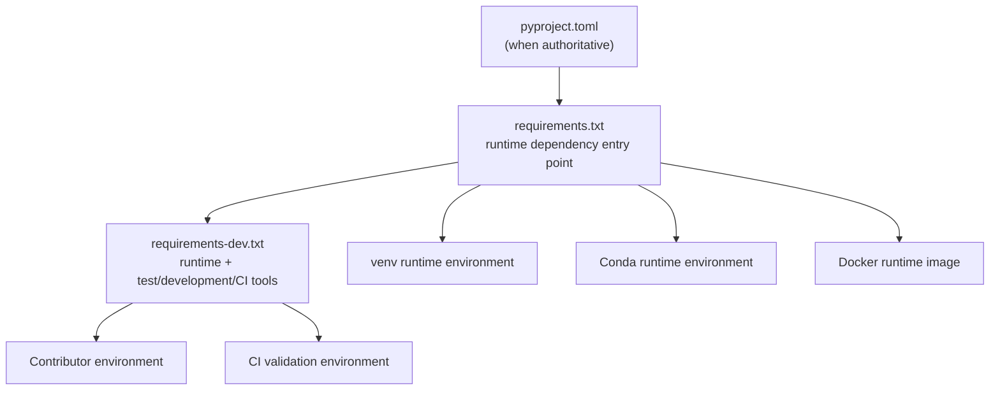
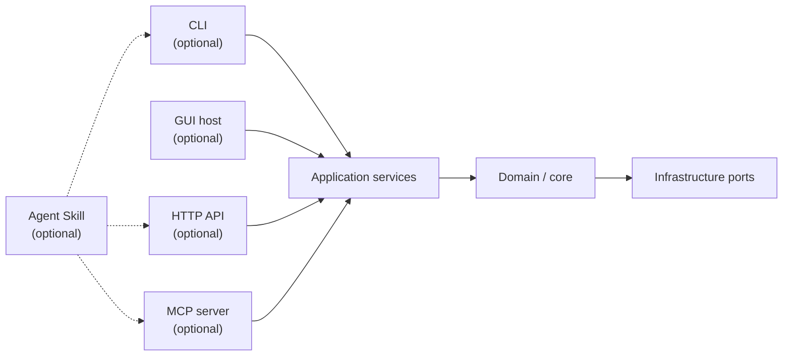
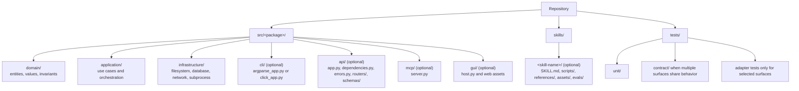
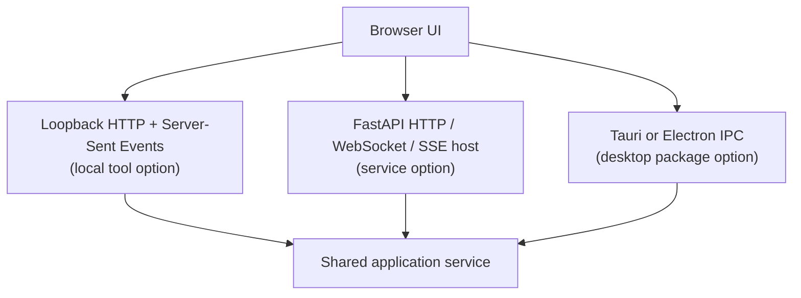
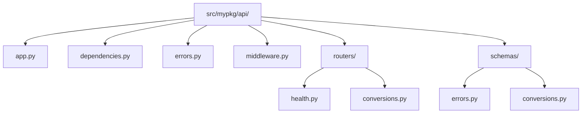
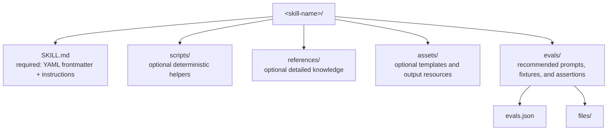
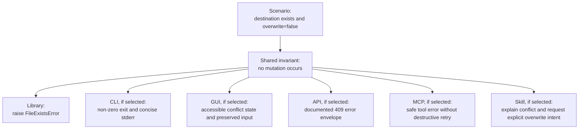

CODING.md

# Coding Standards for Human and AI Contributors

A practical, enforceable standard for repositories that should be readable, maintainable, testable, reproducible, and easy for downstream users to adopt. It is written for human contributors and AI coding agents, including Claude Code, OpenCode, Cursor, Copilot, and similar tools.

The goal: every project should read like a **teaching artefact**, not a private side project. Examples, docstrings, types, tests, dependency metadata, and clear documentation are part of the public contract with users and contributors.

## How to interpret this document

The keywords **MUST**, **MUST NOT**, **SHOULD**, **SHOULD NOT**, and **MAY** are normative:

* **MUST / MUST NOT**: mandatory unless an explicit task requirement or repository-specific constraint makes the rule inapplicable.
* **SHOULD / SHOULD NOT**: the expected default; deviations require a concrete technical reason.
* **MAY**: optional and context-dependent.

Apply rules proportionally, without inventing unnecessary infrastructure:

* A new production repository or a request for full compliance should implement every relevant rule.
* An existing repository should preserve its architecture and improve the files and workflows touched by the task. Avoid unrelated rewrites merely to satisfy this document.
* Conda, Docker, credential examples, AI evaluation, and language-specific tooling are required only when they are relevant to the project or explicitly requested.
* When this document conflicts with an explicit task instruction, repository governance, or a supported platform constraint, follow the more specific instruction and clearly report the deviation. Never silently ignore a rule.

## Agent execution contract

An AI coding agent applying these standards MUST:

1. Inspect the repository, its instructions, and its existing conventions before editing.
2. Implement the requested change completely rather than returning only suggestions or pseudocode.
3. Reuse existing project tooling and dependency sources instead of creating competing configurations.
4. Keep changes focused. Do not rename, reformat, or restructure unrelated code without a clear reason.
5. Add or update tests and documentation whenever behavior, interfaces, setup, or configuration changes.
6. Run the relevant checks available in the repository. Never claim that a command passed if it was not run.
7. Report changed files, checks run, and any remaining limitation or unverified assumption.
8. Never commit secrets, private credentials, generated caches, local environments, or machine-specific paths.

---

## 0. Scope: all functions, all languages, no exceptions

These standards apply to **every function, method, and class**, including:

* Private and internal functions (`def _helper`, `def __internal`)
* Dunder methods (`__init__`, `__repr__`, `__eq__`, ...)
* Nested functions, closures, lambdas promoted to named functions
* Module-private helpers and script-only utilities

There is **no exemption based on naming convention or visibility**. A leading underscore signals *intended audience*, not *lower quality*. Private code must meet the same documentation, typing, commenting, and testing bar as public code.

This scope also applies across **all languages present in the repository**, not only Python. If the project contains JavaScript/TypeScript (`_name`), shell scripts, Rust, Go, C/C++ (`_name`, `name_`), or any other language, the equivalent conventions of that language apply with the same "no private-code exemption" rule:

* Every function gets a doc comment (JSDoc, rustdoc, GoDoc, Doxygen, shell header comment, ...)
* Every function is typed to the extent the language allows
* Every function is covered by tests

Do not silently omit a language, a file, or a function from these rules.

### Expected repository baseline

For a typical Python project, the repository SHOULD expose an obvious structure similar to the following, adapted rather than copied mechanically:

```text
README.md
EXAMPLES.md
CODING.md
pyproject.toml                 # Tooling and package metadata when applicable.
requirements.txt              # Runtime installation entry point.
requirements-dev.txt          # Runtime plus contributor and CI tools.
src/<package>/ or <package>/  # Importable source code.
tests/                        # Pytest suite.
.github/workflows/            # CI when GitHub Actions is used.
environment.yaml              # Optional: minimal Conda wrapper.
Dockerfile                    # Optional: production container path.
.dockerignore                 # Required whenever Dockerfile exists.
```

Do not create empty ceremonial files. Each file must have a real purpose, and optional files appear only when the corresponding workflow is supported.

---

## 1. Use NumPy-style docstrings for every function and class

Every function and class — **public or private, including `def _*` and `def __*`** — MUST include a NumPy-style docstring.

Recommended sections, in order:

* Short summary
* Optional extended summary
* `Parameters`
* `Returns` or `Yields`
* `Raises`
* `Examples`
* `Notes`

Use Sphinx-friendly underlines.

```python
def add(a: int, b: int) -> int:
    """Return the sum of two integers.

    Parameters
    ----------
    a : int
        First operand.
    b : int
        Second operand.

    Returns
    -------
    int
        ``a + b``.

    Examples
    --------
    >>> add(2, 3)
    5
    """
    return a + b
```

Private helpers follow the same rules:

```python
def _normalize_name(raw: str) -> str:
    """Normalize a raw user-provided name for comparison.

    Parameters
    ----------
    raw : str
        Name as typed by the user, possibly with stray whitespace
        or inconsistent casing.

    Returns
    -------
    str
        Lower-cased, stripped name suitable for dictionary keys.

    Examples
    --------
    >>> _normalize_name("  Alice ")
    'alice'
    """
    return raw.strip().lower()
```

For private functions, the `Examples` section may be shortened when the function is trivial, but the summary, `Parameters`, and `Returns` sections are always required.

---

## 2. Add a module-level docstring to every `.py` file

Every Python file MUST start with a module-level docstring. This includes private modules (`_internal.py`, `_utils.py`) — no exceptions.

It should explain what the module does, why it exists, what it consumes, and what it produces.

Suggested structure:

```python
"""
Short one-line description.

Module summary
--------------
Longer paragraph explaining what this module does, why it exists,
what it consumes, and what it produces.

Usage example
-------------
>>> from mypkg import my_function
>>> my_function(42)
42

Author
------
Project maintainer or organization name.
"""
```

For public templates, use neutral attribution when an author block is genuinely useful, such as:

```text
Author
------
Project maintainers.
```

---

## 3. Use full typing

Type-annotate **every** function signature — public, private (`_*`), name-mangled (`__*`), and dunder methods — including parameters and return values.

Also type-annotate class attributes (including private attributes like `_cache`) and module-level constants where reasonable.

Prefer:

```python
from __future__ import annotations
```

Use `TypedDict`, `dataclasses`, `Protocol`, or `pydantic` models when returning or passing structured data.

Example:

```python
from __future__ import annotations

from typing import TypedDict


class UserRecord(TypedDict):
    """Represent a normalized user record."""

    id: int
    name: str
    is_active: bool
```

Private example — same rigor:

```python
def _load_cache(path: Path) -> dict[str, UserRecord]:
    """Load the on-disk user cache."""
    ...
```

---

## 4. Comment generously — everywhere, in every function

Comment **a lot**. Good old comments are a first-class deliverable of this standard, not decoration. Code without comments is considered incomplete, exactly like code without tests.

This rule applies **everywhere, with no exceptions**:

* Public functions and private functions (`_*`, `__*`)
* Dunder methods, nested functions, one-liners with non-obvious intent
* Scripts, tests, CI files, configuration, shell scripts
* Every language in the repository (`#`, `//`, `/* */`, `<!-- -->`, `--`, `;` — use whatever the language provides)

Practical expectations:

* Every **logical block** of code (a loop, a branch, a transformation step, a tricky expression) gets a comment above it explaining what it does and **why**.
* A reader should be able to follow the flow of any function by reading **only the comments**, top to bottom, like a narrated story.
* When in doubt, add the comment. Over-commenting is a much cheaper problem than under-commenting.
* Prefer block comments above the code rather than cramped inline comments — but short inline comments are fine for clarifying a single value or condition.

Recommended ratio:

* **Target ≈ 1 comment line for every 3–4 lines of code** (≈25–30 % density), measured per file, **docstrings excluded**. Docstrings are excluded so the ratio measures actual in-code narration, not API documentation — a file can be fully docstringed and still have zero comments inside its function bodies, which is exactly what this ratio is designed to catch.
* **Higher density is never a defect.** There is no upper limit: going well above the target because the code genuinely needs the narration is encouraged, not tolerated.
* **Floor: never below 1 comment line per 6 lines of code** (≈15 %) in any source file. A file under the floor is treated like a file with missing tests: fix it before merging.
* Trivial glue files (short `__init__.py`, re-export modules) may fall below the floor, but they still need their module docstring.

Measuring the ratio is easy and can be wired into CI:

```bash
# cloc reports code vs comment lines per language and per file.
cloc --by-file src/
```

The ratio is a guardrail, not a game: padding files with parrot comments to
hit the number defeats the purpose and should be rejected in review.

Good comments explain:

* Why a library was chosen
* Why an algorithm or trade-off was selected
* Why an edge case matters
* Why a constraint exists
* What a non-obvious block is about to do, before it does it

The only bad comment is one that merely parrots trivial code (`i += 1  # increment i`). Everything else is welcome.

```python
def _merge_records(base: dict[str, int], patch: dict[str, int]) -> dict[str, int]:
    """Merge ``patch`` into ``base`` without mutating either input."""
    # Work on a copy: callers rely on `base` staying untouched,
    # and silent mutation bugs here are painful to track down.
    merged = dict(base)

    # Apply the patch entries one by one. We iterate explicitly
    # (rather than merged.update(patch)) because we want to skip
    # sentinel values below.
    for key, value in patch.items():
        # A value of -1 is our "delete this key" sentinel, coming
        # from the legacy import format. Remove instead of storing it.
        if value == -1:
            merged.pop(key, None)
            continue

        # Normal case: patch wins over base on conflicts.
        merged[key] = value

    return merged
```

```python
# We normalize paths before comparison because Windows paths are
# case-insensitive while POSIX paths are not.
normalized_path = path.resolve()
```

---

## 5. Include an `EXAMPLES.md` file at the repository root

Every project MUST include a self-contained, runnable cookbook of its main use cases.

`EXAMPLES.md` should:

* Be written in English
* Contain practical examples users can copy and run
* Cover the most common workflows
* Be linked from `README.md`
* Be linked from localized documentation when relevant

Example README mention:

```markdown
See [`EXAMPLES.md`](EXAMPLES.md) for more recipes.
```

---

## 6. Avoid accidental bare `print(...)` in source code

Do not use bare `print(...)` for diagnostics, progress reporting, warnings, or debugging in actual `.py` source files. This includes private modules and private functions — a `print` hidden inside `_debug_helper` is still an uncontrolled output side effect.

Use logging for operational messages:

```python
import logging

logger = logging.getLogger(__name__)

logger.info("Processing started")
```

This keeps verbosity controlled from one place rather than scattered across the codebase.

Intentional command-line output is different from diagnostic output. A CLI MAY write its documented result to standard output or its errors to standard error, preferably through the project's CLI framework or a small, testable output abstraction. Such output must be deliberate, documented, and covered by CLI tests; it must not be an ad hoc debugging `print`.

Documentation snippets may use `print(...)` because tutorials should remain simple to read.

Allowed contexts include:

* `README.md`
* `EXAMPLES.md`
* localized docs
* docstring examples
* tutorials
* intentional, tested CLI output

---

## 7. Document expected output after `print(...)` in examples

When documentation examples use `print(...)`, show the expected output with a comment.

```python
result = add(2, 3)
print(result)  # 5
```

Or:

```python
print(add(2, 3))
# 5
```

This helps readers understand the example without running it.

---

## 8. Provide example config files when credentials are needed

Any project that loads credentials should include a committed example config file.

Examples:

```text
app_config.json.example
database_config.json.example
secrets.yaml.example
```

The example file should include:

* Required keys
* Optional keys
* Dummy values
* **Profuse comments** whenever the format allows them

Comment-friendly formats (YAML, TOML, JSONC, INI, `.env`) should be **heavily commented** — this is rule 4 applied to configuration. In particular, every dummy value must be accompanied by a comment explaining:

* **What** the value is and what it is used for
* **How to obtain the real value** (which dashboard, which page, which command)
* **What a valid value looks like** (format, length, prefix)
* Whether the key is **required or optional**, and its default

Prefer YAML over plain JSON for new config files precisely because YAML supports comments. If you must use JSON, consider `.jsonc` or move the explanations into `README.md`.

Fully-commented YAML example:

```yaml
# secrets.yaml.example
# --------------------
# Copy this file to `secrets.yaml` and replace every dummy value.
#   cp secrets.yaml.example secrets.yaml
# `secrets.yaml` is gitignored (see rule 9) — never commit real values.

# REQUIRED — API key for the Example.com service.
# How to get it: log in at https://dashboard.example.com,
# then Settings > API Keys > "Create key".
# Real keys look like: `exk_live_` followed by 32 hex characters.
api_key: "replace-with-your-api-key"   # e.g. exk_live_0123abcd...

# REQUIRED — Base URL of the API.
# Keep the default unless you are on a self-hosted instance.
base_url: "https://api.example.com"

# OPTIONAL — Request timeout in seconds (default: 30).
# Raise this if you process large uploads on a slow connection.
timeout_seconds: 30

# OPTIONAL — SMTP password for outgoing notification emails.
# How to get it: ask your mail provider for an "app password";
# do NOT reuse your personal account password here.
# Leave empty to disable email notifications entirely.
smtp_password: ""
```

Strict JSON fallback (comments are not valid JSON, so keep values self-describing and document every key in `README.md` instead):

```json
{
  "api_key": "replace-with-your-api-key",
  "base_url": "https://api.example.com",
  "timeout_seconds": 30
}
```

Use JSONC only when the application explicitly supports a JSONC parser; do not label commented JSON as ordinary JSON.

Reference the example file from:

* `README.md`
* `EXAMPLES.md`
* localized documentation, if any

---

## 9. Gitignore real config files, but keep examples tracked

If a project ships a config example, real config files should be ignored.

Example `.gitignore`:

```gitignore
# Ignore local configuration and secret files.
*.env
*.local.yaml
*.local.yml
*config.json
secrets.yaml
secrets.yml

# Keep committed examples and templates visible to Git.
!*.env.example
!*config.json.example
!*.yaml.example
!*.yml.example
```

This prevents accidental secret commits when users copy an example into a real local configuration file. Verify the ignore rules with `git check-ignore -v <path>` when adding a new secret-bearing format.

---

## 10. Keep acknowledgements optional and project-specific

Acknowledgements should be neutral and easy to adapt.

Suggested English form:

```markdown
Special thanks to the contributors, reviewers, and users who helped improve this project.
```

Suggested French form:

```markdown
Remerciements chaleureux aux contributrices, contributeurs, relectrices, relecteurs et utilisateurs qui ont aidé à améliorer ce projet.
```

For public templates, avoid hard-coding personal names unless the project explicitly requires them.

---

## 11. Provide cross-platform install instructions

Every OS-level dependency MUST include installation instructions for the three canonical desktop platforms:

* macOS 🍎
* Ubuntu 🐧
* Windows 🪟

Canonical block:

```markdown
- macOS 🍎 : `brew install ffmpeg`
  (install `brew` thanks to [brew.sh](https://brew.sh/))
- Ubuntu 🐧 : `sudo apt install ffmpeg`
- Windows 🪟 : `winget install ffmpeg`
```

Additional requirements:

* **Every `brew install` mention, anywhere in the documentation**, must be immediately followed by the [brew.sh](https://brew.sh/) hint shown above — not only in the main install section. First-time macOS users may land on any snippet and won't know what `brew` is.
* If a package is genuinely unavailable on a platform, say so explicitly rather than silently omitting the platform:

```markdown
- Windows 🪟 : no first-party Windows package — build from source or use WSL2.
```

---

## 12. Keep AI-assistant attribution policy explicit

For projects using AI assistance, decide whether AI tools should appear in public attribution.

Recommended default for most repositories:

* Do not list AI assistants as authors, contributors, or co-authors.
* Do not add AI-generated `Co-Authored-By` trailers to commits.
* Attribute human maintainers and contributors only.
* Mention AI tooling only when the project policy explicitly allows it.

Example policy:

```markdown
AI tools may be used during development, but authorship and responsibility remain with the human maintainers. Commit authorship, release notes, and contributor lists should name only human contributors unless the project governance explicitly states otherwise.
```

If past public history contains unwanted AI attribution, do not rewrite shared history casually. Rewriting public Git history is destructive and should be scoped, discussed, and approved first.

---

## 13. Separate runtime and development dependencies

Every Python project MUST provide two obvious installation entry points at the repository root:

* `requirements.txt` for dependencies required to install, import, and run the project
* `requirements-dev.txt` for testing, linting, formatting, typing, documentation, local development, and CI

The distinction is functional, not cosmetic. Production and downstream users should not need to install `pytest`, Ruff, coverage tools, documentation builders, notebook tooling, or other contributor-only packages.

### Runtime requirements

The version numbers in this section are illustrative structure, not evergreen recommendations. An agent MUST select ranges compatible with the repository's supported Python versions and current dependency policy rather than copying example numbers blindly.

`requirements.txt` contains only runtime dependencies. A package belongs here when the application or library imports or invokes it during normal operation.

```text
# requirements.txt
requests>=2.32,<3
pydantic>=2.8,<3
```

Do not add:

* Standard-library modules such as `pathlib`, `json`, or `logging`
* Test packages such as `pytest`
* Linters and formatters such as Ruff
* Type checkers such as mypy
* Packages used only to build documentation or releases

A dependency used by both production code and tests is a runtime dependency and belongs in `requirements.txt`. Never hide a real runtime dependency in the development file merely because the test suite happens to install it.

### Development, test, and CI requirements

`requirements-dev.txt` MUST include the runtime requirements first, then add contributor-only tools:

```text
# requirements-dev.txt
# Install the same runtime dependencies exercised by production.
-r requirements.txt

# Test runner and coverage reporting.
pytest>=8.2,<9
pytest-cov>=5,<7

# Formatting, linting, and static analysis.
ruff>=0.9,<1
mypy>=1.11,<2

# Dependency vulnerability checks used by CI.
pip-audit>=2.7,<3
```

This makes one command sufficient for a complete contributor environment:

```bash
python -m pip install --upgrade pip
python -m pip install -r requirements-dev.txt
```

### Keep one source of truth

If the project declares package dependencies in `pyproject.toml`, do not maintain a second handwritten copy that can drift. Keep `pyproject.toml` authoritative. The simplest runtime requirements entry point installs the project itself:

```text
# requirements.txt
# Install this project and its runtime dependencies from pyproject.toml.
.
```

The development file may then extend that installation as usual:

```text
# requirements-dev.txt
-r requirements.txt
pytest>=8.2,<9
pytest-cov>=5,<7
ruff>=0.9,<1
mypy>=1.11,<2
```

For applications that require a fully resolved deployment set, `requirements.txt` MAY instead be generated from `pyproject.toml` by an approved locking or compilation tool. The generated header MUST identify the source file and regeneration command; contributors must not edit the generated file by hand.

For non-package scripts without `pyproject.toml` dependency metadata, list the direct runtime dependencies in `requirements.txt` itself.

### Version and reproducibility policy

Use one dependency per line and add comments for non-obvious constraints. Never leave dependencies completely unbounded.

* **Reusable libraries:** declare supported version ranges in `pyproject.toml`; avoid exact runtime pins that unnecessarily prevent downstream dependency resolution.
* **Applications and deployed services:** prefer a generated lock file or fully pinned deployment requirements so the same build can be reproduced later.
* **Development tools:** use bounded versions and update them deliberately. CI should not start failing because a brand-new major version was released overnight.
* Do not blindly use `pip freeze` as the maintained dependency specification. It records the entire current environment, including transitive and unrelated packages. Generate lock or constraint files intentionally when exact resolution is required.

Whenever dependencies change, update the relevant requirements file, installation documentation, and lock or constraint file in the same commit.

### CI installation rule

CI jobs that run tests, coverage, Ruff, type checking, documentation, or dependency audits MUST install `requirements-dev.txt`:

```yaml
- name: Install dependencies
  run: |
    python -m pip install --upgrade pip
    python -m pip install -r requirements-dev.txt
```

Deployment builds and runtime smoke tests should install only `requirements.txt`. This catches accidental reliance on development-only packages before release.

Document both commands in `README.md` and `EXAMPLES.md`:

```bash
# Runtime / production installation.
python -m pip install -r requirements.txt

# Contributor, test, and CI installation.
python -m pip install -r requirements-dev.txt
```


---

## 14. Provide consistent local Conda and Docker workflows when relevant

When the project should run through multiple environments, every path MUST consume the same Python dependency contract. Conda and Docker are execution wrappers, not independent places to maintain duplicate Python package lists.

The supported dependency flow is:



Do not maintain different Python dependency versions in `environment.yaml`, a `Dockerfile`, CI YAML, and requirements files. Version drift between execution paths is a defect.

### Minimal Conda environment

When Conda support is relevant, commit an almost-empty `environment.yaml` at the repository root. Conda should provide the Python interpreter, `pip`, and only genuinely Conda-specific native/system dependencies. Python packages remain owned by the requirements files. Conda environment could be something like `env-for-<PROJECT>` where `<PROJECT>` is the name of the project folder or repo for example.

The examples below use Python 3.12 only as a concrete template. Replace it with the repository's declared supported minor version and keep that value synchronized across Conda, Docker, CI, and documentation.

Canonical runtime environment:

```yaml
# environment.yaml
# ----------------
# Keep this file intentionally small. Python package dependencies are
# maintained in requirements.txt, which is shared with venv, Docker, and CI.
name: env-for-<PROJECT>
channels:
  - conda-forge
dependencies:
  # Pin the supported Python minor version so contributors reproduce CI.
  - python=3.12
  - pip

  # Delegate Python package installation to the canonical runtime file.
  - pip:
      - -r requirements.txt
```

Local runtime setup:

```bash
conda env create -f environment.yaml
conda activate env-for-<PROJECT>
```

For development and tests, layer the contributor requirements into the activated environment:

```bash
python -m pip install -r requirements-dev.txt
pytest -q
```

Rules for Conda support:

* Keep the environment name and Python version aligned with `README.md`, CI, and the project's supported-version policy.
* Do not list the same Python package under both `dependencies` and `pip` unless a documented platform constraint requires it.
* Add native libraries to the Conda section only when Conda is intentionally responsible for them; explain why with comments.
* Do not export and commit a large machine-generated environment file as the maintained specification. `conda env export` commonly captures platform-specific transitive packages and build strings.
* A fully locked Conda file MAY be generated separately for a controlled deployment, but it must not replace the small human-maintained `environment.yaml`.
* If Conda is advertised as supported, smoke-test environment creation periodically in CI or in a dedicated scheduled workflow.

### Docker runtime

When container execution is relevant, commit at least:

* `Dockerfile`
* `.dockerignore`
* documented build and run commands

The production image MUST install runtime dependencies from `requirements.txt`, not `requirements-dev.txt`.

Canonical starting point:

```dockerfile
# Pin at least the Python major/minor version. For high-assurance deployments,
# additionally pin the base image by digest through the release process.
FROM python:3.12-slim AS runtime

# Prevent Python from writing bytecode and ensure logs are emitted immediately.
ENV PYTHONDONTWRITEBYTECODE=1 \
    PYTHONUNBUFFERED=1

WORKDIR /app

# This cache-friendly pattern assumes requirements.txt lists third-party
# packages and does not install the local project with a `.` entry.
COPY requirements.txt ./
RUN python -m pip install --no-cache-dir --upgrade pip \
    && python -m pip install --no-cache-dir -r requirements.txt \
    && python -m pip check

# Copy only the files required at runtime. Refine this for the project layout.
COPY . .

# Run the application as an unprivileged user.
RUN useradd --create-home --uid 10001 appuser \
    && chown -R appuser:appuser /app
USER appuser

# Replace this placeholder with the project's real, documented entry point.
CMD ["python", "-m", "mypkg"]
```

If `requirements.txt` installs the local project using `.`, the preceding cache-friendly order is not valid because the project source is not present yet. Use a packaging-aware build stage, or copy the project before installation:

```dockerfile
COPY . .
RUN python -m pip install --no-cache-dir --upgrade pip \
    && python -m pip install --no-cache-dir -r requirements.txt \
    && python -m pip check
```

A dedicated wheel-building stage is preferable for mature packaged projects because it improves reproducibility and keeps compilers or build tools out of the runtime image. Correct installation takes priority over layer caching; never keep a Dockerfile pattern that cannot install the declared project.

Canonical `.dockerignore` baseline:

```dockerignore
.git
.github
.venv
venv
__pycache__
*.py[cod]
.pytest_cache
.mypy_cache
.ruff_cache
.coverage
htmlcov
build
dist
*.egg-info
.env
.env.*
secrets.*
```

Adjust the ignore file deliberately: do not exclude files required to build or run the application, and never copy secrets into an image. Use runtime secret injection or the platform's secret manager instead.

### Development containers

A development or CI image MAY install `requirements-dev.txt`, but it must be a separate target or Dockerfile so development tools cannot leak into the production image.

Example additional target:

```dockerfile
FROM runtime AS development

USER root
COPY requirements-dev.txt ./
RUN python -m pip install --no-cache-dir -r requirements-dev.txt \
    && python -m pip check
USER appuser
```

Build the intended target explicitly:

```bash
# Production/runtime image.
docker build --target runtime -t env-for-<PROJECT>:local .

# Development/test image.
docker build --target development -t env-for-<PROJECT>:dev .
docker run --rm env-for-<PROJECT>:dev pytest -q
```

Rules for Docker support:

* Prefer a small, maintained official base image compatible with required native libraries.
* Use a non-root runtime user unless the platform makes that impossible.
* Do not bake credentials, `.env` files, SSH keys, cloud configuration, or tokens into image layers or build arguments.
* Use exec-form `ENTRYPOINT` or `CMD` arrays so signals are delivered correctly.
* Add a health check when the container exposes a long-running service and a meaningful health endpoint exists.
* Use Docker Compose only when multiple services or non-trivial local orchestration justify it. Do not introduce Compose for a single simple process.
* Scan production images and Python dependencies in CI when the repository's risk profile warrants it.
* If Docker is advertised as supported, CI MUST at least build the production image; preferably it should also run a lightweight smoke test.

### Documentation parity

`README.md` and `EXAMPLES.md` MUST show the supported paths without making users infer them:

```bash
# Standard Python environment.
python -m pip install -r requirements.txt

# Conda runtime environment.
conda env create -f environment.yaml
conda activate env-for-<PROJECT>

# Docker runtime image.
docker build --target runtime -t env-for-<PROJECT>:local .
docker run --rm env-for-<PROJECT>:local
```

For each path, document prerequisites, configuration injection, the real application command, exposed ports or mounted volumes, and how to run tests when applicable.

---

## 15. Use `pytest` and require CI to pass

Every Python project MUST ship:

* A `tests/` directory
* `pytest`-based tests
* A CI workflow that runs on every push and pull request

Recommended requirements:

* Use plain `pytest` functions and fixtures where possible.
* Put shared fixtures in `tests/conftest.py`.
* Mirror the source tree as the project grows.
* Ensure **every function and class is covered at least once, including private ones** (`_helper`, `__internal`) — coverage may come from functional/scenario tests that exercise many functions at once; a dedicated test per function is not required (see the 100-test rule below).
* Prefer meaningful coverage over chasing 100% coverage.
* Track coverage with `pytest-cov` when useful.
* Keep tests deterministic.
* Seed randomness.
* Mock network, disk, and clock boundaries.
* Mark slow integration tests with `@pytest.mark.slow`.
* Keep the fast test suite runnable in seconds.

Example local command:

```bash
pytest -q
```

With coverage:

```bash
pytest --cov=mypkg tests/
```

Document the exact CI command in:

* `README.md`
* `EXAMPLES.md`
* localized documentation, if any

A failing test should block merging to the main branch. CI should also run `python -m pip check` after installation so incompatible dependency resolutions fail early. Projects supporting multiple Python versions SHOULD test the oldest and newest supported versions; applications SHOULD additionally test the production deployment path.

### Rationalize the suite at the 100-test mark

Test count is not a quality metric. When a project's suite reaches **~100 tests**, stop and rationalize before adding more:

* **Prefer quality over quantity.** A smaller suite of meaningful, well-named, well-commented tests beats a sprawling suite of mechanical ones.
* **Move away from the "one test / one function" schema.** Early on, one unit test per function is a fine bootstrap. At scale it produces brittle, redundant tests that mirror the implementation and break on every refactor.
* **Prefer functional tests that cover several use cases end-to-end.** One scenario test that walks a realistic workflow (load config → ingest data → transform → export) exercises many functions at once, catches integration bugs unit tests miss, and documents how the project is actually used.
* **Merge and prune.** Fold overlapping micro-tests into parameterized tests (`@pytest.mark.parametrize`) or scenario tests; delete tests that only re-verify what another test already proves.
* **Keep targeted unit tests where they earn their place**: tricky algorithms, edge cases, regression tests pinned to a past bug (with a comment referencing the issue).

Practical rhythm: at ~100 tests, hold a suite review. Ask of each test: *what failure would this catch that nothing else catches?* If the answer is "none", merge it or delete it. Coverage should stay stable or improve during rationalization — the goal is fewer, stronger tests, not less protection.

---

## 16. Add AI evaluation when the project uses AI

For projects involving AI, regular unit tests are not enough.

This applies to projects using:

* LLM prompts
* RAG
* Agents
* Embeddings
* Generative models
* Classical ML models
* Model inference pipelines

Add an evaluation layer with at least one dedicated framework.

Recommended options:

* [DeepEval](https://github.com/confident-ai/deepeval) for LLM-focused evaluation
* [Giskard](https://github.com/Giskard-AI/giskard) for ML and LLM testing

AI evaluation should include:

* A committed evaluation dataset
* Explicit metrics
* Versioned thresholds
* CI gating
* Model and dataset pinning
* Cost controls such as cached LLM responses
* A human-review path for open-ended generation

Example thresholds:

```text
answer_relevancy > 0.70
hallucination_rate < 0.05
robustness_score > 0.90
```

Do not rely on “vibe checks” as the only validation layer.

---

## 17. Enforce PEP 8 — automatically, in CI, no exceptions

All Python code follows [PEP 8](https://peps.python.org/pep-0008/), the official Python style guide. The rules in this document build **on top of** PEP 8 — they never replace it.

PEP 8 compliance is **enforced, not suggested**:

* A linter/formatter checking PEP 8 **must** run in CI on every push and pull request.
* A PEP 8 violation **blocks merging** to the main branch, exactly like a failing test.
* Enforcement is automatic — humans review logic, tools review style. Style debates in review are a waste of everyone's time.
* No file, function, or contributor is exempt (see rule 0). `# noqa` suppressions are allowed only with a comment justifying **why**, and should be rare.

In practice, PEP 8 governs:

* **Naming**: `snake_case` for functions and variables, `PascalCase` for classes, `UPPER_CASE` for constants, leading underscore for internal use (`_helper`).
* **Layout**: 4-space indentation, two blank lines between top-level definitions, one between methods.
* **Imports**: at the top of the file, one per line, grouped stdlib / third-party / local, each group separated by a blank line.
* **Whitespace**: around operators and after commas, none just inside brackets.
* **Comparisons**: `is None` / `is not None`, no comparison to `True`/`False`, `isinstance()` over type equality.

Required setup — a linter config committed to the repository:

```toml
# pyproject.toml — Ruff enforces PEP 8 (pycodestyle "E"/"W" rules) and much more.
[tool.ruff]
line-length = 79          # PEP 8 default; a team may standardize on 88/100,
                          # but pick ONE value and write it down here.

[tool.ruff.lint]
select = ["E", "W", "F", "I", "D"]   # pycodestyle, pyflakes, isort, pydocstyle

# Enforce the NumPy-style docstring convention required by rule 1.
[tool.ruff.lint.pydocstyle]
convention = "numpy"
```

Required CI gate (and recommended as a pre-commit hook so violations never even reach CI):

```bash
# Both commands must exit 0 for the pipeline to pass.
ruff check src/ tests/
ruff format --check src/ tests/
```

Notes:

* **Line length**: PEP 8 says 79 characters. Diverging (e.g. 88, Black's default) is acceptable *only* if the project pins the chosen value in its formatter config so every contributor and CI agree.
* **Docstrings**: PEP 8 defers to PEP 257; this document goes further and mandates NumPy-style docstrings (rule 1). Rule 1 wins.
* **Comments**: PEP 8's guidance on comments (complete sentences, `# ` with a space, block comments over inline) applies — and rule 4's density requirements come on top of it.
* **Other languages** (see rule 0): enforce the equivalent canonical style guide and formatter the same way — `gofmt` for Go, `rustfmt` for Rust, Prettier + ESLint for JS/TS, `shfmt`/ShellCheck for shell — all CI-gated.

---

## 18. Shift expensive validation left to reduce CI load

CI remains the authoritative merge gate, but it SHOULD NOT be the first place
contributors discover failures that can be reproduced locally. Repositories
SHOULD move deterministic validation as close as practical to the contributor's
machine so feedback is faster and shared CI capacity is reserved for checks
that genuinely require centralized infrastructure.

This policy applies beyond formatting and linting. Relevant local checks may
include:

* Unit and targeted integration tests
* Type checking and static analysis
* Dependency consistency and vulnerability checks
* Documentation builds and link validation
* Package, wheel, and container builds
* Schema, migration, generated-code, and lock-file consistency checks
* AI evaluation subsets with bounded cost and cached responses
* Any other deterministic validation that is expensive when repeated remotely

### Use one command contract everywhere

The repository MUST expose documented commands, scripts, or task-runner targets
that are shared by developers, AI coding agents, and CI. CI should invoke the
same underlying commands rather than reimplementing them in workflow YAML.

A typical interface might be:

```bash
# Fast checks suitable during normal editing.
make check-fast

# Checks relevant to the files or component being changed.
make test-changed

# Complete validation expected before opening or updating a pull request.
make check
```

The exact tool is project-specific: `make`, `just`, `tox`, `nox`, `pre-commit`,
package-manager scripts, or small repository scripts are all acceptable. Do not
introduce a second task runner when the project already has one.

### Match check cost to the local trigger

Use layered local enforcement instead of running every expensive check after
every file save:

* **On save or pre-commit:** formatting, linting, generated-file checks, and
  other fast deterministic checks.
* **Pre-push:** affected tests, type checking, package validation, and other
  medium-cost checks relevant to the changed area.
* **Before pull request or handoff:** the full documented local validation
  suite, including expensive tests and builds that can run reliably on a
  contributor machine.

Hooks SHOULD call the repository's canonical commands and SHOULD remain easy to
run manually. A hook is a convenience and an early warning system, not the only
place where validation logic exists.

### Reduce repeated work safely

Local and CI workflows SHOULD use supported caching, test selection, incremental
analysis, and change-aware execution when these optimizations preserve
correctness. Examples include dependency caches, compiler caches, pytest test
selection, monorepo affected-project detection, Docker layer caching, and cached
AI-evaluation responses.

Optimizations MUST fail safely. When change impact cannot be determined with
confidence, run the broader check. Periodic or main-branch CI SHOULD still run
the complete suite to detect mistakes in selective execution and cache-related
blind spots.

### Keep CI authoritative and focused

Local success does not replace CI. CI MUST still verify merge requirements in a
clean, reproducible environment and MUST run checks that depend on protected
secrets, service containers, platform matrices, production images, or other
centralized infrastructure.

However, CI workflows SHOULD avoid spending server time on failures that a
standard local command would have caught immediately. Repositories SHOULD:

* Document the local command that corresponds to each CI job.
* Reuse identical configuration and dependency sources locally and remotely.
* Avoid duplicating the same expensive job across overlapping workflows without
  a concrete reason.
* Cancel superseded branch runs when the CI platform supports it.
* Separate fast pull-request gates from slower scheduled, release, or exhaustive
  validation when the risk model permits it.

The goal is not to weaken CI. The goal is to make CI the reproducible final
verification layer rather than an expensive remote development loop.

---

## How to apply these standards

### With an AI-augmented programming agent (recommended)

The fastest way to apply this document is to hand it to an AI-augmented programming agent or editor — Claude Code, OpenCode, Cursor, VS Code with Copilot, or any similar tool — and require the agent to treat it as an execution contract, not optional background reading.

For a one-off task, paste this document together with the request and use an instruction such as:

```text
Read and follow the attached CODING.md before changing anything.

Execute the requested task end to end. First inspect the repository and reuse
its existing architecture and tooling. Apply every relevant MUST rule to all
created or modified files, including private functions, dependency files,
tests, documentation, CI, Conda, and Docker when applicable.

Do not create duplicate dependency sources. Keep changes focused, run the
relevant repository checks, and do not claim that an unrun check passed.
At completion, report changed files, commands run, failures, and any deliberate
deviation from CODING.md.
```

This works well for one-off scripts, new repositories, refactors, and compliance passes. The task prompt should still state the concrete outcome; `CODING.md` defines how the work is performed, not what feature to invent.

Once adopted, promote the document to the agent's **project instructions file** so it is loaded automatically in every session instead of pasted by hand:

* `CLAUDE.md` at the repository root for Claude Code
* `AGENTS.md` at the repository root for OpenCode and other agents that support it
* `.cursor/rules/` for Cursor
* `.github/copilot-instructions.md` for VS Code with Copilot
* the equivalent tracked instruction file for any other agent

Keep the instruction file short and link to this document rather than copying divergent versions of the same standards into several tool-specific files. If a tool does not reliably follow links, generate the tool-specific file from `CODING.md` and document the synchronization mechanism.

Alternatively, commit it as `CODING.md` and reference it from the instructions file:

```markdown
<!-- CLAUDE.md / AGENTS.md -->
Read and strictly follow [CODING.md](CODING.md) before editing.
Apply every relevant rule to created and modified files. Reuse existing
tooling, keep dependency declarations synchronized, run relevant checks,
and report any unverified command or deliberate deviation.
```

* Agents are also good at **retrofitting**: point one at an existing repository and ask it to bring files up to compliance rule by rule (add missing docstrings, raise comment density to the rule 4 ratio, wire up Ruff and CI per rule 17).
* Trust but verify: the dependency and CI gates defined in rules 13–15 and 17 apply to agent-written code exactly as to human-written code. An agent's output that fails `ruff check` or drops below the comment-density floor gets fixed before merging, like anyone else's.

### By hand

When editing an existing `.py` file:

1. Bring the touched file closer to compliance.
2. Add missing types and docstrings where practical — including on private `_*` functions.
3. Add comments to every logical block you touch — the edited code should read like a narrated story.
4. Avoid leaving newly edited code half-styled.
5. Add or update tests for changed behavior.

When creating a new `.py` file:

1. Add `from __future__ import annotations`.
2. Add a module-level docstring.
3. Type all functions and classes, private ones included.
4. Add NumPy-style docstrings to all functions and classes, private ones included.
5. Comment every logical block generously, from the very first draft — never "I'll add comments later".
6. Add tests from the start.

When making a documentation-only or style-only release:

1. Use a patch version bump if appropriate.
2. Update `CHANGELOG.md`.
3. Group the change under a `Documentation` or `Maintenance` section.


---

## Definition of done

A task is complete only when every applicable item below is true:

* The requested behavior is implemented and integrated with the existing architecture.
* New and changed code follows the repository's language conventions, typing policy, documentation policy, and comment expectations.
* Tests cover the changed behavior, important errors, and relevant private implementation paths without duplicating low-value tests.
* Runtime and development dependencies are declared in the correct canonical files, with no unexplained duplicate source of truth.
* User-facing setup, configuration, examples, CLI behavior, Conda instructions, and Docker instructions are updated when affected.
* Relevant formatters, linters, type checks, tests, dependency checks, builds, and smoke tests have been run successfully, or the final report states exactly which checks could not be run and why.
* Generated files, caches, local environments, credentials, and machine-specific artifacts are not included accidentally.
* The diff is focused, reviewable, and free from unrelated churn.
* The final report is factual: it names changed files, executed commands, observed results, and remaining limitations without exaggeration.

## Core principle

A good repository should be understandable by a new reader, testable by a contributor, reproducible in CI, and usable without private context.

Documentation, examples, typing, tests, and evaluation are not extras. They are part of the software — for every function, in every language, with no private-code exceptions.
---

## 19. Design capabilities for one or more coding surfaces

A **coding surface** is a supported way for a human or software agent to use the
same underlying capability. The principal surfaces covered by this standard are:

* Python/library calls
* Command-line interfaces (CLI)
* Graphical user interfaces (GUI)
* HTTP APIs
* Model Context Protocol (MCP) servers
* Agent Skills for Claude Code, Claude.ai, OpenCode, and other compatible agents

A project MAY expose a capability through only a Python library, one delivery
surface, several surfaces, or all of them. Supporting every surface is possible,
but it is not a baseline requirement. Select surfaces according to actual users,
deployment constraints, security boundaries, maintenance capacity, and product
needs.

A repository MUST explicitly state which surfaces it supports. It SHOULD also
identify surfaces that are intentionally unsupported or deferred when that helps
set expectations. Obligations in the following sections apply only to surfaces
that the project selects or advertises. Once advertised, a surface must be
implemented, documented, tested, and kept behaviorally aligned with the shared
capability.

### 19.1 Keep business logic independent from delivery surfaces

Whichever surfaces a project selects MUST be adapters around a shared
application or domain layer. Selected surfaces MUST NOT contain separate copies
of the business rules. This architecture allows a project to start with one
surface and add others later, including an all-surface distribution, without
rewriting the core.

Preferred dependency direction:



Dashed links show possible Skill orchestration paths. A Skill uses enabled
surfaces; it does not replace their implementation.

Rules:

* The core MUST NOT import `argparse`, `click`, FastAPI, FastAPI-MCP, browser
  code, or agent-runtime packages.
* Each selected surface module MAY translate input, authentication context, and
  output format, but MUST delegate actual work to the shared application service.
* Validation rules that express business invariants belong in the core or shared
  schemas. Surface-only validation, such as parsing a CLI flag or HTTP header,
  belongs in the adapter.
* For each selected surface, exceptions from the core MUST be translated into
  surface-appropriate errors: exit codes for CLI, accessible error states for
  GUI, structured HTTP responses for API, MCP tool errors for agents, or
  troubleshooting guidance for Skills.
* A surface MUST NOT reach around the service layer to use database, filesystem,
  subprocess, or network infrastructure directly unless the action is genuinely
  unique to that surface and the reason is documented.

Illustrative boundary:

```python
from __future__ import annotations

from dataclasses import dataclass
from pathlib import Path


@dataclass(frozen=True, slots=True)
class ConversionRequest:
    """Describe one file-conversion request.

    Parameters
    ----------
    source : Path
        Input file to convert.
    destination : Path
        Output path to create.
    overwrite : bool
        Whether an existing output may be replaced.
    """

    source: Path
    destination: Path
    overwrite: bool = False


@dataclass(frozen=True, slots=True)
class ConversionResult:
    """Describe the observable result of a successful conversion.

    Parameters
    ----------
    destination : Path
        File created by the conversion.
    bytes_written : int
        Number of bytes written to the output.
    """

    destination: Path
    bytes_written: int


def convert_file(request: ConversionRequest) -> ConversionResult:
    """Convert a file without depending on any delivery surface.

    Parameters
    ----------
    request : ConversionRequest
        Validated conversion request shared by whichever adapters are enabled,
        such as a CLI, GUI, API, or MCP server.

    Returns
    -------
    ConversionResult
        Details of the created output.

    Raises
    ------
    FileNotFoundError
        If the input path does not exist.
    FileExistsError
        If the destination exists and overwrite is disabled.
    """
    # Validate invariants here so every enabled surface receives identical behavior.
    if not request.source.is_file():
        raise FileNotFoundError(request.source)

    # Refuse silent destructive writes across every enabled adapter.
    if request.destination.exists() and not request.overwrite:
        raise FileExistsError(request.destination)

    # The real implementation would perform the conversion through an injected
    # infrastructure port. The simplified write keeps this example self-contained.
    payload = request.source.read_bytes()
    request.destination.write_bytes(payload)

    return ConversionResult(
        destination=request.destination,
        bytes_written=len(payload),
    )
```

### 19.2 Define one canonical behavioral contract

For every operation exposed on more than one surface, document:

* Canonical operation name
* Inputs, types, defaults, and validation rules
* Output model or schema
* Error taxonomy
* Idempotency and destructive behavior
* Authentication and authorization requirements
* Timeout and cancellation behavior
* Logging, audit, and privacy expectations
* Which surfaces expose the operation and why

A small contract table in `README.md`, `docs/architecture.md`, or generated API
reference is sufficient when the project is small. The first row below
illustrates that a project **can** expose one capability through all surfaces;
the second illustrates deliberate surface restriction:

| Operation | Library | CLI | GUI | HTTP | MCP | Skill |
|---|---:|---:|---:|---:|---:|---:|
| Convert one file | ✅ | ✅ | ✅ | ✅ | ✅ | ✅ |
| Delete all outputs | ✅ | Admin only | ❌ | Admin only | ❌ | ❌ |

Surface parity does **not** mean forcing identical interaction patterns. When both
are selected, a GUI may show a progress bar while a CLI emits newline-delimited
events, but both must use the same operation, defaults, validation, and final
result semantics.

### 19.3 Recommended composable repository layout

Adapt the following rather than copying it mechanically. Every surface branch is
optional; a project may keep one, several, or all of them:



Do not create directories for unsupported surfaces. Empty architecture is not
architecture.

---

## 20. Command-line interfaces: argparse and Click

When a project selects a CLI surface, that production CLI is a public API. Its
command names, flags, output format, exit codes, and help text are compatibility
contracts. Projects without a CLI do not need to add one solely to satisfy this
standard.

### 20.1 Choose one parser per command tree

Both parsers are supported, with different defaults:

* Use **`argparse`** when zero third-party runtime dependencies, a small command
  tree, or standard-library-only distribution is important.
* Use **Click** when the project needs nested groups, reusable parameter types,
  prompts, shell completion, composable command objects, or stronger built-in
  CLI testing support.
* Do not combine `argparse` and Click inside one command tree merely to satisfy
  this document. A repository MAY contain separate tools using different parsers,
  but each executable must have one clear owner.
* Do not migrate a stable existing CLI solely to change parser. Preserve its
  contract unless the migration has an explicit user-facing benefit and includes
  compatibility tests.

### 20.2 Common CLI contract

Every CLI MUST:

* Be installed through a declared entry point, preferably `[project.scripts]` in
  `pyproject.toml`, rather than requiring users to know a source-file path.
* Provide useful `--help` at the root and every subcommand.
* Provide `--version` when the project is distributed independently.
* Use kebab-case for commands and long options: `convert-file`, `--dry-run`.
* Reserve standard output for the documented result and standard error for
  diagnostics, warnings, progress, and errors.
* Return deterministic, documented exit statuses.
* Be non-interactive by default in automation. Interactive prompts MUST have an
  explicit non-interactive alternative such as `--yes`, `--force`, or a complete
  set of flags.
* Refuse destructive behavior unless the user explicitly requested it.
* Support `--no-color` or the `NO_COLOR` convention when colored output exists.
* Avoid leaking tokens, passwords, private paths, or full sensitive payloads in
  command history, process listings, logs, and error messages.
* Handle `SIGINT`/Ctrl-C cleanly and return a non-zero status without a traceback
  unless a debug mode was requested.
* Keep human-readable output stable enough for people, but provide a documented
  machine-readable mode such as `--json` or JSON Lines for automation.
* Never require consumers to scrape decorative tables when a structured output
  mode can be provided.

Recommended exit-status policy:

```text
0   Success.
1   Expected operational failure.
2   Invalid command-line usage or validation failure.
3   Configuration or authentication failure.
4   Upstream service unavailable or timed out.
5   Partial completion when the command explicitly supports partial results.
130 Interrupted by Ctrl-C on POSIX-like systems, when preserved by the launcher.
```

Projects MAY choose another policy, but it must be documented and tested.

### 20.3 Make CLI schemas introspectable and GUI-ready

A CLI that may later become a GUI MUST expose a stable command schema:

* Use a parser factory or Click command object that can be imported without
  executing the command.
* Keep parser construction free of network calls, filesystem mutation, and
  environment-dependent side effects.
* Give every option a useful help string, type, default, and required status.
* Use explicit choices/enums rather than burying accepted values in prose.
* Use subcommands for meaningfully different operations instead of dozens of
  unrelated flags.
* Make `tool --help` and `tool subcommand --help` complete enough to serve as a
  reliable source for documentation and GUI generation.
* Do not make importing the parser start logging, load secrets, open a browser,
  connect to a database, or call `sys.exit()`.

### 20.4 Canonical argparse pattern

```python
"""Provide the argparse surface for file conversion."""

from __future__ import annotations

import argparse
import json
import sys
from collections.abc import Sequence
from pathlib import Path

from mypkg.application.conversion import ConversionRequest, convert_file


def make_parser() -> argparse.ArgumentParser:
    """Build the CLI parser without executing the application.

    Returns
    -------
    argparse.ArgumentParser
        Fully configured parser suitable for execution, testing, documentation,
        and GUI introspection.
    """
    # Keep construction deterministic so other tools can import the parser.
    parser = argparse.ArgumentParser(
        prog="filetool",
        description="Convert files through the shared application service.",
    )
    parser.add_argument("--version", action="version", version="%(prog)s 1.0.0")

    # Subcommands make operation boundaries explicit for users and adapters.
    subparsers = parser.add_subparsers(dest="command", required=True)
    convert_parser = subparsers.add_parser(
        "convert",
        help="Convert one input file.",
    )
    convert_parser.add_argument("source", type=Path, help="Input file path.")
    convert_parser.add_argument("destination", type=Path, help="Output file path.")
    convert_parser.add_argument(
        "--overwrite",
        action="store_true",
        help="Replace the destination when it already exists.",
    )
    convert_parser.add_argument(
        "--json",
        action="store_true",
        help="Emit the result as one JSON object.",
    )

    return parser


def main(argv: Sequence[str] | None = None) -> int:
    """Execute the argparse command and return an exit status.

    Parameters
    ----------
    argv : Sequence[str] or None, optional
        Argument vector without the executable name. ``None`` uses ``sys.argv``.

    Returns
    -------
    int
        Process exit status.
    """
    parser = make_parser()
    args = parser.parse_args(argv)

    # Translate surface input into the shared application request.
    request = ConversionRequest(
        source=args.source,
        destination=args.destination,
        overwrite=args.overwrite,
    )

    try:
        result = convert_file(request)
    except (FileNotFoundError, FileExistsError) as exc:
        # argparse.error writes to stderr and exits with status 2. For a library-
        # testable main function, emit the message and return explicitly instead.
        parser.print_usage()
        print(f"filetool: error: {exc}", file=sys.stderr)
        return 2

    # Keep machine output free of decoration and incidental log messages.
    if args.json:
        print(
            json.dumps(
                {
                    "destination": str(result.destination),
                    "bytes_written": result.bytes_written,
                },
                sort_keys=True,
            )
        )
    else:
        print(result.destination)

    return 0
```


### 20.5 Canonical Click pattern

```python
"""Provide the Click surface for file conversion."""

from __future__ import annotations

import json
from pathlib import Path

import click

from mypkg.application.conversion import ConversionRequest, convert_file


@click.group(context_settings={"help_option_names": ["-h", "--help"]})
@click.version_option()
def cli() -> None:
    """Run file conversion commands."""


@cli.command("convert")
@click.argument(
    "source",
    type=click.Path(path_type=Path, exists=True, dir_okay=False),
)
@click.argument("destination", type=click.Path(path_type=Path, dir_okay=False))
@click.option(
    "--overwrite",
    is_flag=True,
    help="Replace the destination when it already exists.",
)
@click.option("--json-output", is_flag=True, help="Emit one JSON object.")
def convert_command(
    source: Path,
    destination: Path,
    overwrite: bool,
    json_output: bool,
) -> None:
    """Convert SOURCE into DESTINATION.

    Parameters
    ----------
    source : Path
        Existing input file.
    destination : Path
        Output file to create.
    overwrite : bool
        Whether an existing destination may be replaced.
    json_output : bool
        Whether to emit a machine-readable result.
    """
    # Keep the command function thin and translate only surface concerns.
    request = ConversionRequest(
        source=source,
        destination=destination,
        overwrite=overwrite,
    )

    try:
        result = convert_file(request)
    except (FileNotFoundError, FileExistsError) as exc:
        # ClickException produces a concise stderr message and exit status 1.
        raise click.ClickException(str(exc)) from exc

    if json_output:
        click.echo(
            json.dumps(
                {
                    "destination": str(result.destination),
                    "bytes_written": result.bytes_written,
                },
                sort_keys=True,
            )
        )
        return

    click.echo(result.destination)
```

### 20.6 CLI tests are mandatory

For either parser, test at least:

* Root and subcommand help
* Happy path
* Missing required arguments
* Invalid types and choices
* Every documented exit-status family
* Standard-output versus standard-error separation
* JSON or machine-readable output schema
* Destructive-operation confirmation and non-interactive behavior
* Paths containing spaces and Unicode
* Ctrl-C/cancellation where relevant
* Parser import with no side effects

Argparse tests SHOULD call `main([...])` directly and capture streams with pytest.
Click tests SHOULD use `click.testing.CliRunner`, which captures output, exit status,
and exceptions in an isolated invocation.

---

## 21. Graphical interfaces using the `front` skills

When a project needs a web GUI, a CLI-to-GUI wrapper, or a UI audit, contributors
and coding agents SHOULD use the [`front`](https://github.com/warith-harchaoui/front)
skill set rather than inventing a separate visual system from scratch.

The `front` project provides Claude Code and OpenCode skills for UI rules,
CLI-to-GUI conversion, accessibility, color/contrast, UX laws, publishing,
figures, vision, and audio. The generated GUI remains repository-owned source code:
it MUST be reviewed, tested, secured, and maintained like handwritten code.

### 21.1 Pin and verify the skill release

Do not install an unpinned moving branch in CI or a reproducible contributor
workflow. Use a reviewed tagged release and verify its checksum.

```bash
# Version reviewed when this section was written. Update deliberately.
VERSION=0.33.0

curl -L -o front-skills.tar.gz \
  "https://github.com/warith-harchaoui/front/releases/download/v${VERSION}/front-skills-${VERSION}.tar.gz"
curl -L -o SHA256SUMS \
  "https://github.com/warith-harchaoui/front/releases/download/v${VERSION}/SHA256SUMS"

# macOS 🍎: `shasum` is built in; install Homebrew only for other dependencies.
shasum -a 256 -c SHA256SUMS

# Ubuntu 🐧 alternative:
# sha256sum -c SHA256SUMS

# Windows 🪟: use PowerShell `Get-FileHash` and compare against SHA256SUMS,
# or perform the installation inside WSL2.

tar xzf front-skills.tar.gz
```

Install only the required skills into the active agent runtime:

```bash
# Claude Code:
RUNTIME=claude
# OpenCode alternative:
# RUNTIME=opencode

mkdir -p ~/.${RUNTIME}/skills
cp -r front-ui ~/.${RUNTIME}/skills/
cp -r front-cli-gui ~/.${RUNTIME}/skills/
cp -r front-accessibility ~/.${RUNTIME}/skills/
cp -r front-colors ~/.${RUNTIME}/skills/
cp -r front-ux-laws ~/.${RUNTIME}/skills/
```

Rules:

* `front-ui` SHOULD be installed for every GUI task because it owns the shared
  stack rules and design tokens.
* `front-cli-gui` MUST be installed when wrapping an existing CLI.
* `front-accessibility`, `front-colors`, and `front-ux-laws` SHOULD gate every
  user-facing HTML output.
* Add `front-publish` for documentation sites, metadata, favicons, sitemaps,
  feeds, and `llms.txt`.
* Add `front-figures` for charts, diagrams, explainability visuals, or visual
  refinement workflows.
* Add `front-vision` or `front-audio` only when the corresponding local model
  dependencies and privacy implications are acceptable.
* Record the pinned `front` version in the repository documentation or a tooling
  manifest so upgrades are reviewable.

### 21.2 GUI architecture rules

A selected GUI MUST call the shared application service used by any other
enabled surfaces. The project does not need a CLI or HTTP API merely because it
has a GUI. When the browser cannot call Python directly, use a narrow host
adapter:



The browser MUST NOT receive an endpoint that executes arbitrary command strings.
Use an allowlisted operation name and a validated structured payload. Never build
shell commands by concatenating untrusted values.

For a CLI-to-GUI project, the workflow MUST:

1. Inventory root and subcommand help, parser source, defaults, choices, and output.
2. Classify each operation as one-shot, form-driven, long-running/streaming, or
   list-producing.
3. Map booleans to toggles, bounded choices to segmented controls or selects,
   paths to file controls, numbers to validated numeric controls, and repeated
   values to list/tag controls.
4. Keep the original CLI available for automation and debugging.
5. Wire the GUI to a structured host adapter, not to a raw shell.
6. Represent progress and cancellation explicitly for long-running work.
7. Show errors in an accessible summary and associate field errors with controls.
8. Document exactly how to launch the GUI and its host.

The `front-cli-gui` emitter supports importable `argparse` parser factories,
Click command objects, and a `--from-help` fallback. Prefer importable parser
objects because they preserve types, defaults, required markers, and choices more
reliably than parsing help text.

### 21.3 Baseline front-end contract

Unless the repository explicitly adopts another maintained stack, generated GUI
output SHOULD follow the `front-ui` defaults:

* Semantic HTML
* Vanilla JavaScript ES modules
* Tailwind utility classes with semantic tokens
* Light and dark color schemes
* Visible focus rings
* Keyboard operation for every interactive control
* Minimum comfortable hit areas
* `prefers-reduced-motion` support
* Self-hosted assets when privacy or offline use matters
* Monospace presentation for logs and command output
* No inaccessible color-only status communication

A project MAY use React, Vue, Svelte, or another framework when its architecture
already requires it. In that case, apply the same design tokens, accessibility,
UX, contrast, and audit gates rather than replacing the existing framework.

### 21.4 Production hardening is not optional

The `front-cli-gui` scaffold intentionally leaves production hardening to the host.
Before a GUI is exposed beyond trusted loopback use, implement and test:

* Authentication and authorization
* Operation allowlists
* Input size and type limits
* Rate limits and concurrency limits
* Timeouts and cancellation
* Subprocess sandboxing or process isolation when a CLI is invoked
* Fixed executable paths and argument arrays; never `shell=True` with user input
* Output truncation and log redaction
* CSRF protection when cookies authenticate state-changing requests
* Deliberate CORS policy
* TLS at the deployment boundary
* Secure file-upload handling and temporary-file cleanup
* Audit logs for destructive or privileged operations

### 21.5 GUI verification gates

A GUI task is incomplete until the project has:

* Unit tests for state transformations and host adapters
* Integration tests for at least one complete user workflow
* Accessibility lint with zero unexplained findings
* Contrast and color-vision-deficiency checks where colors are introduced
* Keyboard-only workflow verification
* Narrow and wide viewport checks
* Loading, empty, error, success, and partial-result states
* Long-running task cancellation tests when applicable
* A visual inspection pass on actual rendered output, not only source review

Generated code MUST NOT be exempt from linting, typing, tests, security review, or
repository ownership merely because an agent or skill produced it.

---

## 22. HTTP APIs using FastAPI

A project is not required to expose an HTTP API. When it selects a Python HTTP
API surface, this standard recommends FastAPI as the default implementation. The
selected API layer MUST remain a thin adapter around shared application services.

### 22.1 Structure FastAPI applications for growth

Use an application factory and `APIRouter` modules rather than one unbounded file.
A typical layout is:



The application factory SHOULD own:

* App metadata and OpenAPI settings
* Router registration
* Lifespan resources
* Exception handlers
* Middleware
* Observability hooks
* Environment-dependent documentation exposure

Routers SHOULD own transport details only. Database sessions, settings, identities,
and service objects SHOULD be supplied through explicit dependencies.

### 22.2 OpenAPI is a maintained contract

Every route MUST define enough metadata for both human clients and agent tooling:

* Explicit `operation_id`
* Summary and useful description
* Stable tags
* Request model
* Response model
* Success status code
* Documented error responses
* Authentication requirements
* Deprecation state when applicable

Explicit `operation_id` values are especially important because FastAPI-MCP uses
them as MCP tool names.

```python
"""Expose conversion operations over HTTP."""

from __future__ import annotations

from pathlib import Path

from fastapi import APIRouter, status
from pydantic import BaseModel, Field

from mypkg.application.conversion import ConversionRequest, convert_file

router = APIRouter(prefix="/v1/conversions", tags=["mcp-safe", "conversions"])


class ConversionCreate(BaseModel):
    """Represent an HTTP request to convert one server-side file."""

    source: str = Field(min_length=1, description="Allowlisted source identifier.")
    destination: str = Field(
        min_length=1,
        description="Allowlisted destination identifier.",
    )
    overwrite: bool = False


class ConversionRead(BaseModel):
    """Represent a completed conversion."""

    destination: str
    bytes_written: int = Field(ge=0)


@router.post(
    "",
    operation_id="create_conversion",
    response_model=ConversionRead,
    status_code=status.HTTP_201_CREATED,
    summary="Convert one file",
)
def create_conversion(payload: ConversionCreate) -> ConversionRead:
    """Convert one file through the shared application service.

    Parameters
    ----------
    payload : ConversionCreate
        Validated transport request.

    Returns
    -------
    ConversionRead
        Public representation of the completed conversion.
    """
    # Resolve public identifiers through an allowlisted storage service in real
    # code; do not accept unrestricted server filesystem paths from clients.
    request = ConversionRequest(
        source=Path(payload.source),
        destination=Path(payload.destination),
        overwrite=payload.overwrite,
    )
    result = convert_file(request)

    return ConversionRead(
        destination=str(result.destination),
        bytes_written=result.bytes_written,
    )
```

### 22.3 API behavior rules

Every API MUST:

* Version breaking public contracts, commonly under `/v1`.
* Use Pydantic models for structured input and output rather than anonymous
  dictionaries at public boundaries.
* Return one consistent structured error envelope for application errors.
* Distinguish authentication (`401`), authorization (`403`), missing resources
  (`404`), conflict (`409`), invalid input (`422` or documented alternative),
  rate limiting (`429`), and server failure (`5xx`).
* Avoid exposing stack traces, SQL, local paths, secrets, or internal exception
  representations.
* Apply object-level authorization, not merely route-level authentication.
* Define pagination for collections before unbounded responses become a problem.
* Use idempotency keys or naturally idempotent semantics for retry-prone writes
  where duplicate execution would be harmful.
* Bound upload sizes, request bodies, concurrency, and execution time.
* Provide cancellation or job resources for operations too long for a normal HTTP
  request lifecycle.
* Use UTC timestamps with explicit offsets and unambiguous serialized formats.
* Make health/readiness endpoints cheap and avoid leaking sensitive internals.

### 22.4 Async correctness

Use `async def` only when the implementation awaits non-blocking I/O. Do not call
blocking database clients, CPU-heavy functions, synchronous HTTP clients, or long
subprocess operations directly on the event loop.

Rules:

* Keep a synchronous route synchronous when its dependencies are synchronous.
* Use async-compatible clients consistently when choosing async.
* Move CPU-bound or long-running work to a worker/process boundary.
* Set explicit upstream timeouts.
* Close clients, pools, and other resources through lifespan management.
* Test cancellation and resource cleanup for streaming or long-running endpoints.

### 22.5 Authentication, authorization, and secrets

FastAPI dependencies SHOULD centralize identity and authorization checks. Use
`Security(...)` when OAuth scopes are part of the public contract.

Never:

* Put secrets in route defaults, source code, generated OpenAPI examples, or logs.
* Trust a user-supplied object identifier without checking access to that object.
* Treat possession of a valid token as authorization for every operation.
* Enable permissive CORS with credentials in production.

### 22.6 API tests and contract checks

Use pytest with FastAPI/Starlette `TestClient` for synchronous tests or HTTPX for
async tests. Tests MUST cover:

* OpenAPI generation and uniqueness of `operation_id`
* Happy path and response schema
* Request validation failures
* Every application error translation
* Authentication and object-level authorization
* Idempotency or retry behavior for relevant writes
* Pagination boundaries
* Rate/size/timeout behavior where implemented
* Dependency overrides for deterministic isolation
* Startup/lifespan and shutdown cleanup

For a public or agent-consumed API, CI SHOULD snapshot or diff the OpenAPI schema
and require explicit review of breaking changes.

---

## 23. MCP servers using FastAPI-MCP

A project is not required to expose MCP tools. When an MCP surface is useful,
use [`FastAPI-MCP`](https://github.com/tadata-org/fastapi_mcp) to expose a reviewed
subset of selected FastAPI operations as MCP tools. MCP is an agent-facing
surface, not a second place to implement business logic.

### 23.1 Expose a curated tool set, never the whole API by accident

FastAPI-MCP can derive tools from FastAPI routes and preserve their schemas and
documentation. This convenience increases the importance of an explicit exposure
policy.

Rules:

* Default to an **allowlist** using `include_operations` or `include_tags`.
* Do not expose every route merely because automatic conversion is available.
* Prefer safe retrieval and narrowly scoped goal-oriented operations.
* Exclude administrative, bulk-destructive, internal, debugging, and credential
  management endpoints.
* State-changing tools require stronger justification, authorization, confirmation
  semantics, idempotency, and audit logging.
* `DELETE` and broad `PUT` operations SHOULD NOT be MCP tools unless the use case
  cannot be met more safely.
* Separate public HTTP API tags from MCP exposure tags when doing so makes review
  clearer.

Canonical mounting pattern:

```python
"""Mount the curated MCP surface for the FastAPI application."""

from __future__ import annotations

from fastapi import FastAPI
from fastapi_mcp import FastApiMCP


def mount_mcp(app: FastAPI) -> FastApiMCP:
    """Create and mount the allowlisted MCP server.

    Parameters
    ----------
    app : FastAPI
        Source FastAPI application containing reviewed routes.

    Returns
    -------
    FastApiMCP
        Mounted MCP adapter, returned for inspection and tests.
    """
    # Expose only routes deliberately tagged for agent use.
    mcp = FastApiMCP(
        app,
        name="File Conversion MCP",
        description="Safely inspect and create file conversions.",
        include_tags=["mcp-safe"],
    )
    mcp.mount_http()
    return mcp
```

A separate MCP deployment MAY be mounted on a different FastAPI application when
network policy, scaling, authentication, or blast-radius isolation requires it.

### 23.2 Tool naming and descriptions

FastAPI-MCP uses FastAPI `operation_id` values as tool names. Therefore every
MCP-exposed route MUST have an explicit, stable, unique `operation_id`.

Tool names MUST:

* Start with a letter
* Contain only letters, numbers, and underscores for broad client compatibility
* Use one naming convention, preferably `snake_case`
* Be concise and describe the action or result
* Remain stable across compatible releases

Every exposed operation MUST document:

* What the tool accomplishes
* When an agent should use it
* Preconditions and authorization requirements
* Parameter meaning, units, formats, and constraints
* Whether it mutates state
* Idempotency/retry behavior
* Expected result
* Important errors and recovery guidance

Descriptions written only for a human Swagger reader are often too vague for tool
selection. Test whether an agent can choose the correct tool among neighboring
operations and construct valid parameters without hidden project knowledge.

### 23.3 Authentication and authorization

FastAPI-MCP can reuse FastAPI dependencies and authorization-header passthrough.
Use those mechanisms instead of inventing a second identity system.

Rules:

* Authenticate the MCP connection or every protected tool call.
* Apply the same object-level authorization as the HTTP route.
* Use least-privilege scopes for agent clients.
* Do not place bearer tokens or client secrets in committed client configuration.
* Redact credentials and sensitive tool arguments from logs and traces.
* Treat OAuth callback, audience, scope, and dynamic-registration compatibility as
  deployment configuration that must be tested with the actual target clients.
* Record which MCP protocol/client combinations were tested; client support may
  lag behind the newest authentication features.

### 23.4 Agent-safe mutation design

For state-changing tools:

* Prefer narrow verbs such as `archive_report` over generic `update_resource`.
* Require explicit identifiers and desired final state.
* Avoid parameters that accept arbitrary code, SQL, shell, paths, or URLs.
* Provide dry-run or preview operations for high-impact actions.
* Return a receipt containing the affected object, resulting state, and audit ID.
* Use idempotency keys or deduplication where retries can duplicate effects.
* Require a separate confirmation token for irreversible actions when practical.
* Make rollback or remediation instructions available to the corresponding Skill.

### 23.5 MCP tests and evaluations

MCP testing MUST include more than checking that `/mcp` responds.

Test:

* The exact allowlisted tool inventory
* Stable tool names
* Input and output schemas
* Useful tool descriptions
* Authentication and authorization
* Safe handling of missing/invalid parameters
* Non-exposure of internal or destructive routes
* Read-only versus mutating behavior
* Idempotent retries
* Timeouts and upstream failures
* Representative agent tool-selection prompts
* Tool behavior independently from any Skill

Keep MCP connectivity tests separate from Skill workflow tests. MCP supplies tools;
Skills supply reusable knowledge and orchestration. A failure in one layer should
be diagnosable without the other.

---

## 24. Agent Skills for Claude and OpenCode

A project is not required to ship an Agent Skill. When reusable agent workflows,
project knowledge, or tool orchestration justify a Skill, treat it as a repository
artifact and executable operational knowledge. Selected Skills must be versioned,
reviewed, tested, and secured with the same rigor as code.

This standard follows:

* Anthropic's *The Complete Guide to Building Skills for Claude*
* The open [Agent Skills specification](https://agentskills.io/specification)
* Agent Skills best practices and evaluation guidance
* Runtime installation conventions used by Claude Code and OpenCode

### 24.1 Standard skill structure

A skill is a directory containing at minimum `SKILL.md`:



Rules:

* The filename MUST be exactly `SKILL.md`.
* The parent directory and frontmatter `name` MUST match.
* The name MUST use lowercase letters, numbers, and single hyphens only; it must
  not start or end with a hyphen.
* Keep the skill as one coherent unit of work that composes with other skills.
* Do not create a skill for behavior the agent already performs reliably without
  project-specific knowledge or workflow guidance.
* Put deterministic logic in scripts and keep judgment/orchestration in the
  instructions.
* Keep references shallow and directly linked from `SKILL.md`; avoid chains of
  references that require repeated discovery.

### 24.2 Portable frontmatter baseline

Use only fields supported by the target runtimes. The portable minimum is:

```yaml
---
name: release-readiness

description: >-
  Audits a repository before release, runs the project's canonical checks,
  verifies packaging and documentation, and produces a factual release report.
  Use when the user asks to prepare, audit, validate, or ship a release.
license: Apache-2.0
compatibility: Requires git and the repository's documented development tools.
metadata:
  author: project-maintainers
  version: "1.0.0"
---
```

Normative constraints from the Agent Skills specification include:

* `name` is required and has a maximum of 64 characters.
* `description` is required, non-empty, and has a maximum of 1024 characters.
* `compatibility`, when present, has a maximum of 500 characters.
* `allowed-tools` is experimental and support varies by client.

The description is the trigger contract. It MUST contain:

1. **What** the skill does.
2. **When** it should activate, using realistic user language, file types, or
   task phrases.
3. Scope boundaries or negative triggers when neighboring skills could conflict.

Bad:

```yaml
description: Helps with releases.
```

Better:

```yaml
description: >-
  Runs the repository's release-readiness workflow: tests, lint, typing,
  packaging checks, changelog validation, and artifact smoke tests. Use when the
  user asks to prepare a release, cut a version, validate a release candidate,
  or audit whether a repository is ready to publish. Do not use for ordinary
  feature development.
```

### 24.3 Use progressive disclosure

Skills should spend context only when useful:

1. **Frontmatter** is always available for discovery and triggering.
2. **`SKILL.md` body** loads when the skill activates.
3. **Linked files** load only when the workflow needs them.

Therefore:

* Keep `SKILL.md` focused on the essential procedure, decision rules, validation,
  and navigation to bundled resources.
* Move long API references, format catalogues, domain glossaries, examples, and
  platform-specific details into `references/`.
* Move reusable executable operations into `scripts/`.
* Move templates and non-instruction resources into `assets/`.
* Keep `SKILL.md` comfortably below 5,000 words; shorter is better when behavior
  remains reliable.
* Do not copy the same long standards into several skills. Link or generate from a
  canonical source and document synchronization.

### 24.4 Write procedures, not aspirations

Instructions MUST be specific, actionable, and verifiable.

Weak:

```markdown
Validate the repository and handle errors appropriately.
```

Strong:

```markdown
1. Read `CODING.md`, `pyproject.toml`, and the CI workflow.
2. Identify the canonical commands already used by the repository.
3. Run the fast checks before editing.
4. Make the smallest focused change.
5. Run the targeted tests, then the full documented check.
6. Report every command executed and its observed result.
7. Do not claim an unexecuted check passed.

When `python -m build` fails, inspect the first packaging error before changing
configuration. Do not add a second dependency source of truth.
```

An effective `SKILL.md` SHOULD contain:

* Purpose and scope
* Triggering and non-triggering conditions
* Required inputs and environment assumptions
* Ordered workflow
* Decision points and defaults
* Tool or script invocation with expected outputs
* Validation loop
* Error handling and recovery
* Completion checklist
* Output/report format
* Links to references and assets

Prefer a strong default procedure over a menu of many equivalent tools. Match
instruction specificity to fragility: exact commands for dangerous or brittle
steps, broader judgment for harmless creative choices.

### 24.5 Ground skills in real expertise

A Skill MUST be derived from concrete project knowledge, successful tasks, actual
runbooks, reviewed code, incident history, schemas, and corrections—not generic
LLM prose alone.

Good source material includes:

* Repository standards and architecture decisions
* API specifications and data schemas
* Real commands and scripts
* Review comments and recurring defects
* Incident reports and recovery runbooks
* Known edge cases
* Accepted examples and output templates
* Tool limitations and environment requirements

After drafting, execute the Skill on real tasks and revise it from the trace. Look
for wasted steps, vague branches, false triggers, missed triggers, duplicated
context, unsafe assumptions, and validation the agent skipped.

### 24.6 Scripts bundled with skills

Scripts are code and inherit every applicable rule in this document.

They MUST:

* Have clear inputs, outputs, and exit statuses
* Be deterministic when practical
* Avoid network access unless documented and necessary
* Validate paths and reject traversal outside allowed workspaces
* Avoid destructive defaults
* Never embed credentials
* Use bounded timeouts and resource limits
* Be directly testable outside the agent runtime
* Write machine-readable output when the Skill consumes the result
* Emit actionable error messages

A Skill MUST NOT instruct the agent to run opaque downloaded code, pipe remote
content directly into a shell, disable security controls, or reveal secrets.

### 24.7 Skills that orchestrate MCP

MCP provides connectivity and tools; a Skill provides the reusable procedure for
using them effectively.

A Skill that depends on MCP MUST:

* Name the required server or capability in `compatibility` or instructions.
* Verify connectivity before starting a long workflow.
* Test the underlying MCP tools independently.
* Use exact tool names that match the reviewed server version.
* Describe the sequence, decision criteria, and dependencies between calls.
* Validate results at each consequential stage.
* Define rollback or remediation for partial failure.
* Avoid assuming tool access implies permission to take every action.
* Explain what to do when authentication, scopes, or server availability fail.

### 24.8 Skill evaluations are mandatory

Start with two or three realistic cases, then expand based on observed failures.
Each evaluation case SHOULD contain:

* A realistic prompt
* A human-readable success definition
* Optional input files
* Assertions over behavior or artifacts
* Whether the Skill should trigger
* Whether a related Skill should not trigger

Recommended layout:

```json
{
  "skill_name": "release-readiness",
  "evals": [
    {
      "id": "obvious-trigger",
      "prompt": "Prepare this repository for a release candidate.",
      "expected_output": "Runs canonical checks and reports factual results.",
      "should_trigger": true,
      "files": []
    },
    {
      "id": "negative-trigger",
      "prompt": "Add a small unit test for the parser.",
      "expected_output": "Normal coding workflow; release skill stays inactive.",
      "should_trigger": false,
      "files": []
    }
  ]
}
```

Evaluate at least:

* Obvious trigger phrases
* Paraphrased triggers
* Unrelated prompts that must not trigger
* Boundary prompts shared with neighboring Skills
* Happy-path workflow quality
* Important errors and missing dependencies
* Produced artifact correctness
* Tool-call safety
* Behavior with and without the Skill, or against the previous version
* Runtime/time/token cost when material
* Human review for open-ended quality

Store outputs per iteration so regressions and improvements can be compared. A
Skill is not proven by one successful demo.

### 24.9 Validate OpenCode/Agent Skills compatibility

OpenCode consumes Agent Skills from a per-skill directory and follows the open
`SKILL.md` format. For portable skills:

* Conform to the Agent Skills specification first.
* Keep client-specific features isolated and documented.
* Validate frontmatter and naming with the reference validator when available:

```bash
skills-ref validate ./skills/release-readiness
```

* Test installation in the actual target directory, commonly:

```text
~/.claude/skills/<skill-name>/SKILL.md
~/.opencode/skills/<skill-name>/SKILL.md
```

* Do not assume every runtime supports experimental `allowed-tools` semantics.
* State OS commands, network requirements, binaries, and package dependencies in
  `compatibility` or a directly linked setup reference.
* Keep the core workflow portable; add runtime-specific annexes only where needed.

### 24.10 Skill distribution and versioning

Every distributed Skill SHOULD have:

* A license or clear internal-use notice
* Version metadata
* Changelog entries for behavioral changes
* Installation and upgrade instructions
* Tested runtime/client matrix
* Integrity verification for release archives
* A rollback path to a previous version

A trigger-description change can be breaking even when no script changed. Review
under-triggering and over-triggering as compatibility concerns.

---

## 25. Cross-surface tests and parity

Unit tests for the core are necessary but not sufficient for selected delivery
surfaces. Each advertised surface MUST have adapter tests. Operations exposed
through two or more surfaces SHOULD have parity tests. A project with only a
library surface does not need to invent adapter tests for unselected surfaces.

### 25.1 Contract-test pattern

Define reusable scenarios against an abstract operation interface, then execute the
same scenario through whichever surfaces are selected:



The exact representation differs, but the invariant must match.

### 25.2 Applicable-surface matrix

For every supported operation, CI SHOULD cover the library and only the delivery
surfaces the project has selected. An unselected column is **not applicable** and
creates no implementation or testing obligation:

| Concern | Library | CLI, if selected | GUI, if selected | API, if selected | MCP, if selected | Skill, if selected |
|---|---:|---:|---:|---:|---:|---:|
| Happy path | ✅ | ✅ | ✅ | ✅ | ✅ | ✅ |
| Validation | ✅ | ✅ | ✅ | ✅ | ✅ | ✅ |
| Authorization | As relevant | As relevant | As relevant | As relevant | As relevant | As relevant |
| Destructive safety | ✅ | ✅ | ✅ | ✅ | ✅ | ✅ |
| Structured output | Model | JSON | DOM/state | JSON/OpenAPI | Tool schema | Artifact/report |
| Cancellation/timeout | As relevant | As relevant | As relevant | As relevant | As relevant | Workflow guidance |
| Documentation | Docstring | `--help` | In-product/README | OpenAPI | Tool description | `SKILL.md` |

Do not mark a surface supported merely because it can theoretically call another
surface. Document and test the actual supported path. Supporting all columns is a
valid design when users genuinely need every surface; it is not the default
completion criterion.

---

## 26. Surface-aware observability and privacy

Use one correlation or operation ID across the GUI host, API, MCP calls, workers,
and audit logs when a workflow crosses surfaces.

Logs MUST record enough to diagnose behavior without recording secrets or private
content. Prefer:

* Operation name
* Correlation ID
* Authenticated actor or service identity in a privacy-appropriate form
* Start/end status and duration
* Sanitized object identifiers
* Retry count and upstream category
* Audit receipt for state changes

Do not log:

* Bearer tokens, API keys, OAuth codes, cookies, or passwords
* Complete sensitive prompts or files by default
* Arbitrary CLI argument vectors when they may contain secrets
* Raw uploaded documents unless explicitly required and protected
* Hidden agent reasoning

Document retention and redaction behavior for production systems.

---

## 27. Surface-aware definition of done

In addition to the existing definition of done, a task that adds or changes one
or more coding surfaces is complete only when every applicable item below is
true. Items for unselected surfaces are not applicable:

* The selected and supported surfaces are explicitly named; no additional surface
  is required merely for symmetry.
* Business logic exists once in the shared core/application layer.
* When an operation is exposed through multiple selected surfaces, their CLI
  flags, GUI controls, API schemas, MCP tool schemas, and Skill instructions agree
  on defaults, constraints, and destructive behavior.
* When a CLI is selected, `argparse` or Click parser construction is importable
  and side-effect free; help, output streams, structured mode, and exit codes are
  tested.
* When a GUI is selected, its output follows the pinned `front` rules and passes
  accessibility, contrast, UX, keyboard, and production-hardening gates.
* When a FastAPI surface is selected, routes use stable explicit `operation_id`
  values and documented models; the OpenAPI contract is tested or diffed when
  public or agent-facing.
* When FastAPI-MCP is selected, it exposes an explicit allowlist rather than the
  whole application; tool names, descriptions, authorization, and mutation safety
  are evaluated.
* When a Skill is selected, it conforms to the target specification, uses
  progressive disclosure, includes real trigger language, and has positive and
  negative eval cases.
* When both MCP and Skills are selected, MCP tools work independently from Skills,
  and Skills degrade clearly when MCP is unavailable.
* Cross-surface parity tests cover important invariants whenever two or more
  selected surfaces expose the same operation.
* Documentation tells users which selected surface to choose, gives runnable
  examples, and makes clear that the architecture can support additional or all
  surfaces later when justified.
* Security, privacy, observability, timeout, cancellation, and rollback behavior
  are addressed proportionally to the risk.

---

## Authoritative references for coding surfaces

These references are external and may evolve. Pin dependency versions, review
release notes, and update this standard deliberately rather than silently copying
new behavior.

### CLI

* [Python `argparse` documentation](https://docs.python.org/3/library/argparse.html)
* [Click commands and groups](https://click.palletsprojects.com/en/stable/commands-and-groups/)
* [Testing Click applications](https://click.palletsprojects.com/en/stable/testing/)

### GUI and `front` skills

* [`warith-harchaoui/front`](https://github.com/warith-harchaoui/front)
* [`front-cli-gui` skill](https://github.com/warith-harchaoui/front/blob/main/front-cli-gui/SKILL.md)
* [`front-ui` skill](https://github.com/warith-harchaoui/front/blob/main/front-ui/SKILL.md)

### FastAPI and MCP

* [FastAPI: bigger applications](https://fastapi.tiangolo.com/tutorial/bigger-applications/)
* [FastAPI: testing](https://fastapi.tiangolo.com/tutorial/testing/)
* [FastAPI dependencies and security](https://fastapi.tiangolo.com/reference/dependencies/)
* [FastAPI-MCP documentation](https://fastapi-mcp.tadata.com/getting-started/welcome)
* [FastAPI-MCP best practices](https://fastapi-mcp.tadata.com/getting-started/best-practices)
* [FastAPI-MCP customization and endpoint filtering](https://fastapi-mcp.tadata.com/configurations/customization)
* [FastAPI-MCP authentication and authorization](https://fastapi-mcp.tadata.com/advanced/auth)

### Agent Skills

* [The Complete Guide to Building Skills for Claude (PDF)](https://resources.anthropic.com/hubfs/The-Complete-Guide-to-Building-Skill-for-Claude.pdf)
* [Agent Skills overview](https://agentskills.io/home)
* [Agent Skills specification](https://agentskills.io/specification)
* [Agent Skills best practices](https://agentskills.io/skill-creation/best-practices)
* [Evaluating Skill output quality](https://agentskills.io/skill-creation/evaluating-skills)
